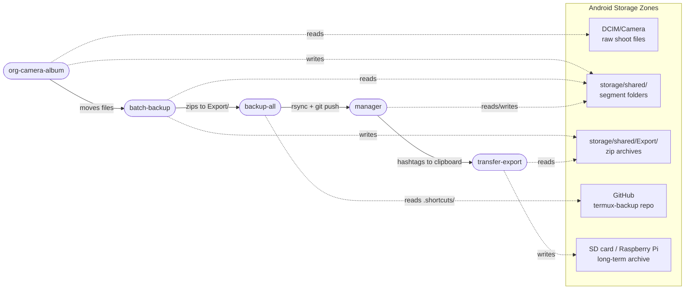
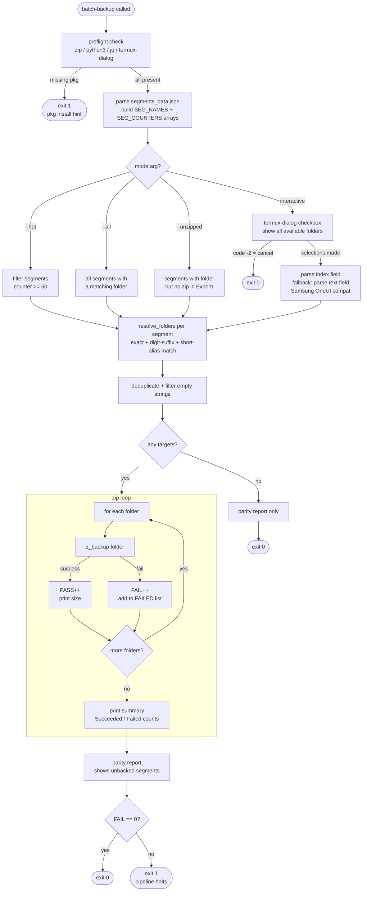
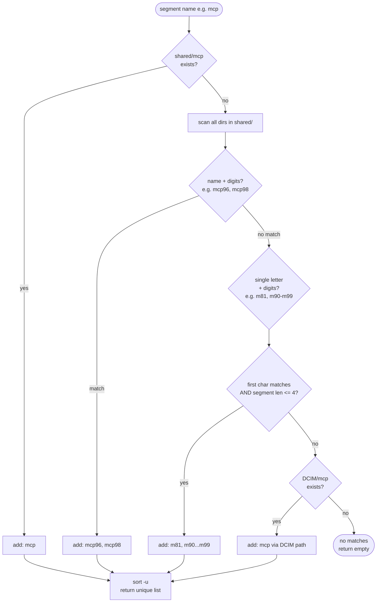
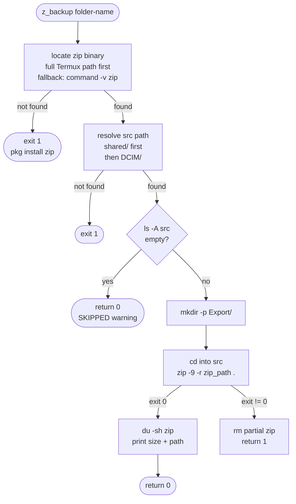
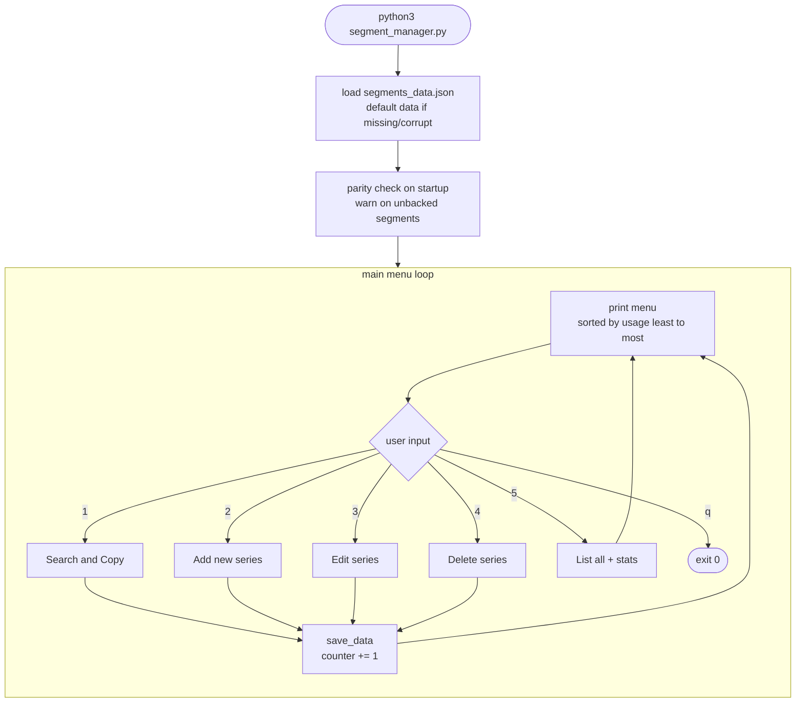
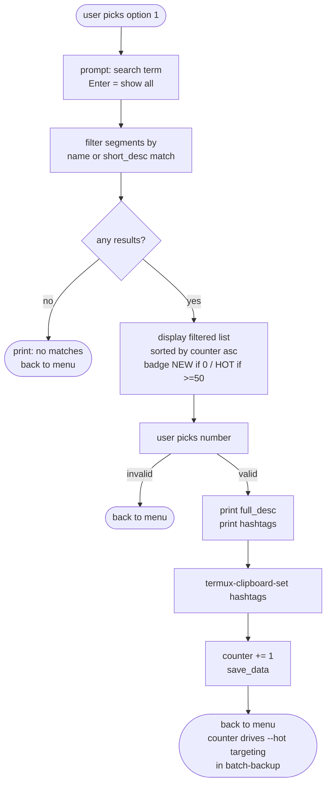
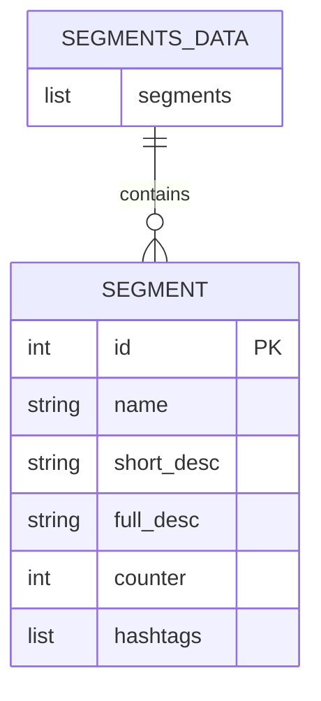

# termux-backup · System Diagrams

Diagrams for the two most complex components (`batch-backup`, `manager`)
and the full pipeline. Render with any Markdown viewer that supports Mermaid
(GitHub, Obsidian, VS Code + Mermaid plugin).

---

## 1. Full content-pipeline flow

---

## 2. batch-backup component

### 2a. Decision tree — mode selection

### 2b. resolve_folders matching strategy

### 2c. z_backup internals

---

## 3. manager (segment_manager.py) component

### 3a. Top-level REPL loop

### 3b. Search and Copy flow (option 1 — most used path)

### 3c. Data model

---

## 4. Component complexity summary

| Script | Lines | Mode | Complexity driver |
|--------|-------|------|-------------------|
| `batch-backup` | ~390 | bash | 4 run modes, folder resolution strategies, Samsung dialog compat, pipeline exit codes |
| `segment_manager.py` | ~200 | python REPL | stateful counter, CRUD, clipboard integration, parity check |
| `transfer-export` | ~200 | bash | dual transport (SSH/rsync + FTP fallback), USB mount detection, SD label routing |
| `content-pipeline` | ~180 | bash | orchestrates all 5 steps, exit code propagation, y/c/n branching at step 2 |
| `org-camera-album` | ~50 | bash | FUSE path resolution, termux-media-scan |
| `backup-all` | ~30 | bash | rsync mirror + git diff detection |
| `z_backup` (.bashrc) | ~45 | bash func | binary path resolution, recursive zip, empty folder guard |

---

## 5. Design decisions

**Why decomposable scripts over a monolith**
Each script exits with a meaningful code and can be run standalone or composed
into `content-pipeline`. This means you can test `z_backup pistol` directly
without running the full pipeline, and failures halt the pipeline at the exact
failing step with a clear message.

**Why segments_data.json drives backup priority**
The `counter` field is a passive usage signal — every hashtag copy in `manager`
increments it. This means `--hot` targeting in `batch-backup` is self-tuning:
high-volume series naturally surface without any manual configuration.

**Why SSH over FTP for Pi transfer**
rsync over SSH gives delta transfers (only changed files), connection reuse,
and no plaintext credentials. FTP is kept as a fallback only because vsftpd
is simpler to set up headlessly before SSH keys are exchanged.

**Why full Termux binary paths in z_backup**
Scripts sourced from `batch-backup` inherit a reduced PATH. Hardcoding
`/data/data/com.termux/files/usr/bin/zip` ensures the binary is found
regardless of how the function is invoked — interactively, from a widget,
or via Termux:Boot.
