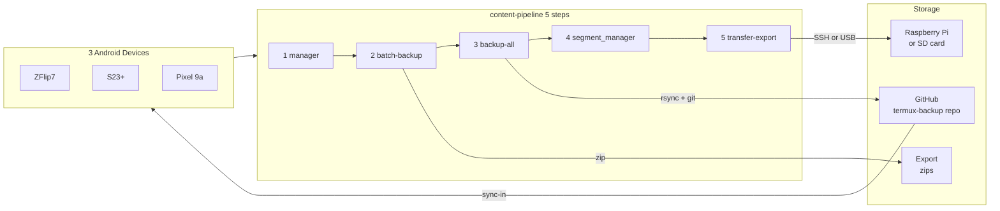
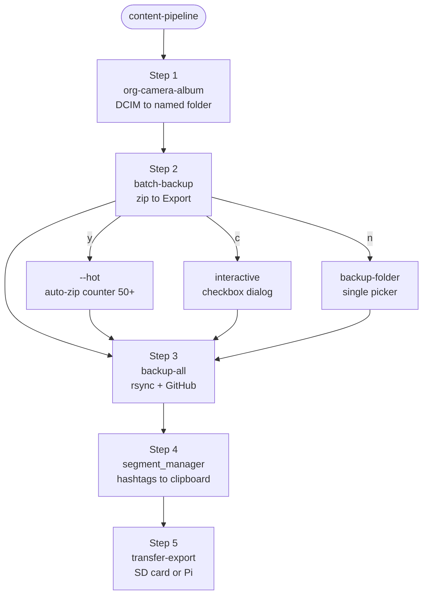
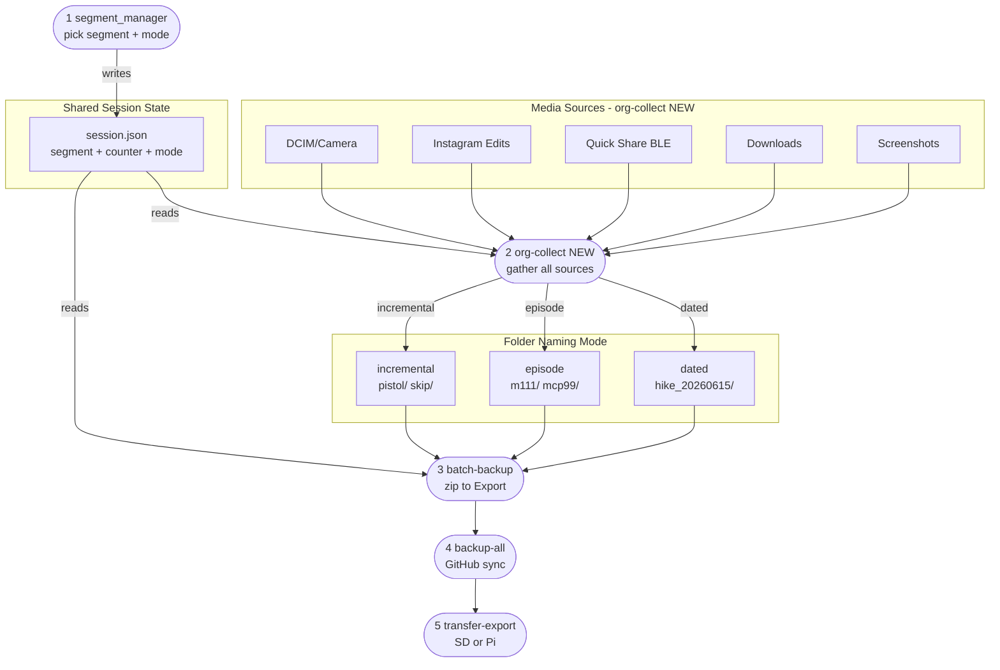
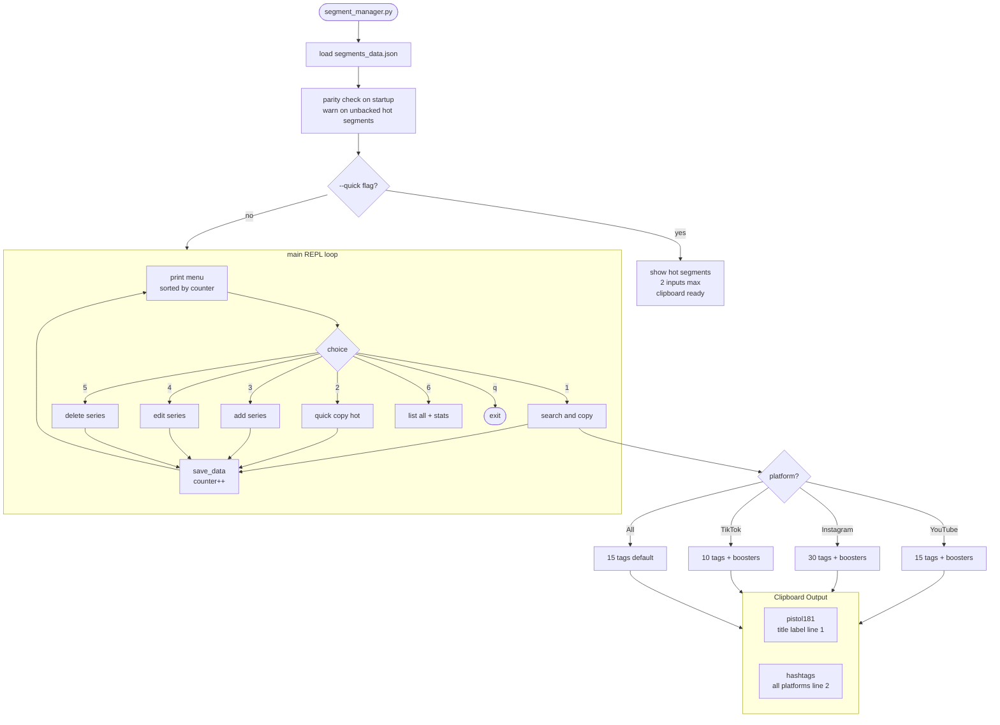
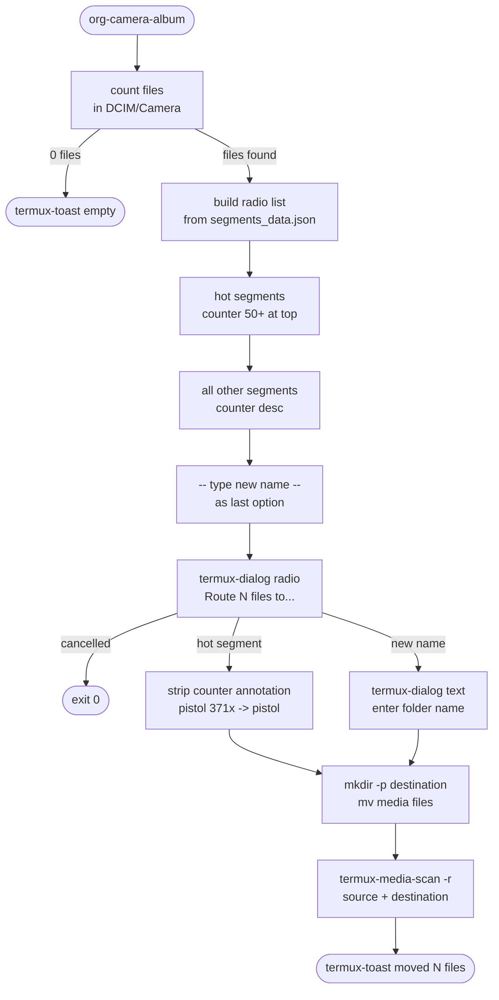
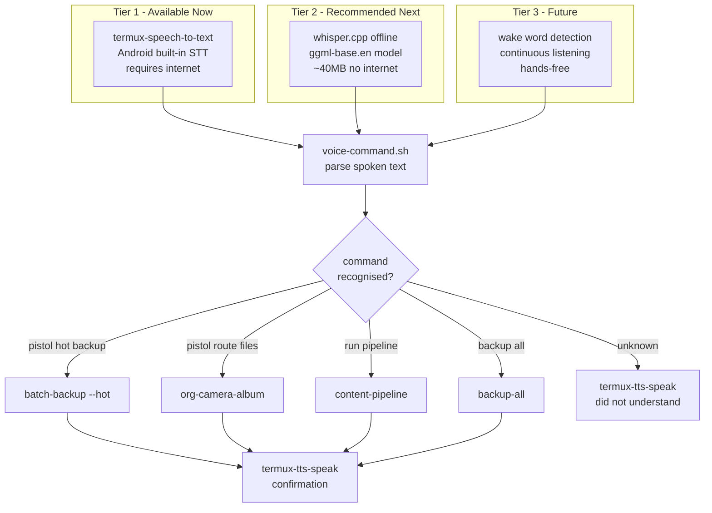

# termux-backup · Content Pipeline


A session-driven, multi-source content pipeline running entirely on Android via Termux.
No laptop. No cloud subscription. 25 min manual post-shoot workflow reduced to under 4 min automated.

> Built by **Samuel Dixon** -- Product Test Engineer, Austin TX  
> linktr.ee/sdixoninvesting -- @sdixoninvesting

---

## Table of Contents

- [Architecture](#architecture)
- [Pipeline v3 (current)](#pipeline-v3-current)
- [Pipeline v4 (proposed)](#pipeline-v4-proposed)
- [Component Deep Dives](#component-deep-dives)
  - [batch-backup](#batch-backup)
  - [segment_manager](#segment_manager)
  - [z_backup internals](#z_backup-internals)
  - [org-camera-album](#org-camera-album)
- [Voice Control (proposed)](#voice-control-proposed)
- [Storage Zones](#storage-zones)
- [Utility Functions](#utility-functions)
- [Installation](#installation)
- [Dependencies](#dependencies)
- [Raspberry Pi Setup](#raspberry-pi-setup)
- [Changelog](#changelog)

---

## Architecture


```mermaid
flowchart LR
    subgraph devices [3 Android Devices]
        D1[ZFlip7]
        D2[S23+]
        D3[Pixel 9a]
    end

    subgraph pipeline [content-pipeline 5 steps]
        P1[1 manager]
        P2[2 batch-backup]
        P3[3 backup-all]
        P4[4 segment_manager]
        P5[5 transfer-export]
    end

    subgraph storage [Storage]
        G[GitHub
termux-backup repo]
        E[Export
zips]
        R[Raspberry Pi
or SD card]
    end

    devices --> pipeline
    P1 --> P2 --> P3 --> P4 --> P5
    P3 -->|rsync + git| G
    P2 -->|zip| E
    P5 -->|SSH or USB| R
    G -->|sync-in| devices
```

---

## Pipeline v3 (current)

The current 5-step post-shoot workflow. Run with one command:

```bash
bash ~/.shortcuts/content-pipeline
```

At step 2 you choose backup mode: `y` = batch-hot (default), `c` = custom select, `n` = single folder.


```mermaid
flowchart TD
    START([content-pipeline]) --> S1

    S1[Step 1
org-camera-album
DCIM to named folder]
    S2[Step 2
batch-backup
zip to Export]
    S3[Step 3
backup-all
rsync + GitHub]
    S4[Step 4
segment_manager
hashtags to clipboard]
    S5[Step 5
transfer-export
SD card or Pi]

    S1 --> S2
    S2 --> S3
    S3 --> S4
    S4 --> S5

    S2 -->|y| HOT[--hot
auto-zip counter 50+]
    S2 -->|c| CUSTOM[interactive
checkbox dialog]
    S2 -->|n| SINGLE[backup-folder
single picker]

    HOT --> S3
    CUSTOM --> S3
    SINGLE --> S3
```

---

## Pipeline v4 (proposed)

Key change: `segment_manager` moves to **step 1** so the selected segment name
flows via `session.json` into every downstream step. No duplicate prompts.


```mermaid
flowchart TD
    subgraph session [Shared Session State]
        SJ[session.json
segment + counter + mode]
    end

    subgraph sources [Media Sources - org-collect NEW]
        S1[DCIM/Camera]
        S2[Instagram Edits]
        S3[Quick Share BLE]
        S4[Downloads]
        S5[Screenshots]
    end

    subgraph modes [Folder Naming Mode]
        M1[incremental
pistol/ skip/]
        M2[episode
m111/ mcp99/]
        M3[dated
hike_20260615/]
    end

    P1([1 segment_manager
pick segment + mode]) -->|writes| SJ
    P2([2 org-collect NEW
gather all sources])
    P3([3 batch-backup
zip to Export])
    P4([4 backup-all
GitHub sync])
    P5([5 transfer-export
SD or Pi])

    SJ -->|reads| P2
    SJ -->|reads| P3

    S1 & S2 & S3 & S4 & S5 --> P2
    P2 -->|incremental| M1
    P2 -->|episode| M2
    P2 -->|dated| M3
    M1 & M2 & M3 --> P3
    P3 --> P4 --> P5
```

### session.json schema

```json
{
  "segment": "pistol",
  "counter": 181,
  "mode": "incremental",
  "timestamp": "2026-06-15T14:30:00"
}
```

| mode | folder | use case |
|------|--------|----------|
| `incremental` | `pistol/` | open-ended series, files accumulate |
| `episode` | `m111/` | numbered series, each shoot discrete |
| `dated` | `hike_20260615/` | one-off or travel content |

---

## Component Deep Dives

### batch-backup

Four run modes. The core workhorse of the pipeline.

```mermaid
flowchart TD
    LAUNCH([batch-backup called]) --> ENV[set HOME + PATH
widget safety guard]
    ENV --> SRC[source .bashrc OR true
prevents set -e silent exit]
    SRC --> PRE[preflight
zip python3 jq termux-dialog]
    PRE --> PARSE[parse segments_data.json
build SEG_NAMES + SEG_COUNTERS]
    PARSE --> MODE{argument?}

    MODE -->|--hot| HOT[segments counter >= 50
auto-targets no dialog]
    MODE -->|--all| ALL[all segment-matched
folders no dialog]
    MODE -->|--unzipped| UNZ[folders with
no zip yet]
    MODE -->|none| DLG[termux-dialog checkbox
all shared/ folders]

    DLG -->|Samsung values field| VPARSE[jq .values[].text
strip annotations]
    DLG -->|standard index field| IPARSE[jq .index
validate bounds]
    DLG -->|text fallback| TPARSE[jq .text
trim + match labels]
    DLG -->|code -2| CANCEL([exit 0 cancelled])

    HOT & ALL & UNZ --> TARGETS
    VPARSE & IPARSE & TPARSE --> TARGETS

    TARGETS[deduplicate
filter blanks] --> LOOP

    subgraph LOOP [zip loop]
        F[for each folder] --> HZ{has existing zip?}
        HZ -->|no| ZB[z_backup direct
new timestamped zip]
        HZ -->|yes| PROMPT[prompt
m merge / a append / s skip]
        PROMPT -->|merge| MRG[extract + combine
re-zip merged_timestamp.zip
delete old zip]
        PROMPT -->|append| APP[z_backup
new zip alongside existing]
        PROMPT -->|skip| SKIP[leave untouched]
        ZB & MRG & APP & SKIP --> NEXT{more?}
        NEXT -->|yes| F
        NEXT -->|no| SUMMARY
    end

    SUMMARY[print summary
PASS FAIL counts] --> PARITY[parity report
unbacked segments]
```

**Known issue:** checkbox dialog (`none` mode) confirmed showing on ZFlip7 but
selection not zipping. Root cause: Samsung returns
`values: [{index:N, text:"name"}]` not a flat array. Fix in v3: `jq .values[].text`.
Status: deployed, awaiting test confirmation.

**Merge/append/skip** -- tested and working on ZFlip7. When a folder already
has a zip in Export/, you are prompted:
- `m` merge: extract + combine files + re-zip as single archive
- `a` append: new timestamped zip alongside existing (default)
- `s` skip: leave existing untouched

---

### segment_manager

Python REPL. The counter drives `--hot` targeting in batch-backup passively.


```mermaid
flowchart TD
    LAUNCH2([segment_manager.py]) --> LOAD[load segments_data.json]
    LOAD --> PCHECK[parity check on startup
warn on unbacked hot segments]
    PCHECK --> QMODE{--quick flag?}
    QMODE -->|yes| QUICK[show hot segments
2 inputs max
clipboard ready]
    QMODE -->|no| MENU

    subgraph MENU [main REPL loop]
        M0[print menu
sorted by counter] --> INPUT{choice}
        INPUT -->|1| SEARCH[search and copy]
        INPUT -->|2| QUICK2[quick copy hot]
        INPUT -->|3| ADD[add series]
        INPUT -->|4| EDIT[edit series]
        INPUT -->|5| DELETE[delete series]
        INPUT -->|6| LIST[list all + stats]
        INPUT -->|q| QUIT([exit])
        SEARCH & QUICK2 & ADD & EDIT & DELETE --> SAVE[save_data
counter++]
        SAVE --> M0
    end

    subgraph CLIP [Clipboard Output]
        CL1[pistol181
title label line 1]
        CL2[hashtags
all platforms line 2]
    end

    SEARCH --> PLAT{platform?}
    PLAT -->|YouTube| YT[15 tags + boosters]
    PLAT -->|Instagram| IG[30 tags + boosters]
    PLAT -->|TikTok| TT[10 tags + boosters]
    PLAT -->|All| ALL2[15 tags default]
    YT & IG & TT & ALL2 --> CLIP
```

---

### z_backup internals


```mermaid
flowchart TD
    IN([z_backup folder]) --> BIN[locate zip binary
full Termux path
fallback command -v]
    BIN -->|not found| FAIL([exit 1
pkg install zip])
    BIN -->|found| RES[resolve src
shared/ first
then DCIM/]
    RES -->|not found| FAIL2([exit 1])
    RES -->|found| EMPTY{ls -A src
empty?}
    EMPTY -->|yes| SKIP2([return 0
SKIPPED])
    EMPTY -->|no| ZIP[cd src
zip -9 -r zip_path .]
    ZIP -->|exit 0| SIZE[print size + path]
    ZIP -->|fail| CLEAN[rm partial
return 1]
```

**Why `zip -r .` not `zip *`:**
The `*` glob fails on empty dirs, skips subdirectories, and errors on
filenames with spaces. `zip -9 -r "$zip_path" .` recurses everything
unconditionally. Exit code 127 = zip binary not in PATH -- fix: `pkg install zip`.

---

### org-camera-album


```mermaid
flowchart TD
    LAUNCH3([org-camera-album]) --> COUNT[count files
in DCIM/Camera]
    COUNT -->|0 files| TOAST([termux-toast empty])
    COUNT -->|files found| BUILDLIST[build radio list
from segments_data.json]
    BUILDLIST --> HOT2[hot segments
counter 50+ at top]
    HOT2 --> OTHER[all other segments
counter desc]
    OTHER --> NEW[-- type new name --
as last option]
    NEW --> DIALOG[termux-dialog radio
Route N files to...]
    DIALOG -->|cancelled| EXIT2([exit 0])
    DIALOG -->|hot segment| STRIP[strip counter annotation
pistol 371x -> pistol]
    DIALOG -->|new name| TEXTINPUT[termux-dialog text
enter folder name]
    STRIP & TEXTINPUT --> MOVE[mkdir -p destination
mv media files]
    MOVE --> SCAN[termux-media-scan -r
source + destination]
    SCAN --> DONE2([termux-toast moved N files])
```

**v4 proposed -- org-collect:** Extends this to pull from 6 sources
(DCIM, Instagram Edits, Quick Share, Downloads, Screenshots, CapCut)
in a single pass, reading destination from `session.json`.

---

## Voice Control (proposed)

Reduce friction for high-volume daily content. Instead of widget taps
and text input, speak the segment name and command.


```mermaid
flowchart TD
    subgraph tier1 [Tier 1 - Available Now]
        V1[termux-speech-to-text
Android built-in STT
requires internet]
    end

    subgraph tier2 [Tier 2 - Recommended Next]
        V2[whisper.cpp offline
ggml-base.en model
~40MB no internet]
    end

    subgraph tier3 [Tier 3 - Future]
        V3[wake word detection
continuous listening
hands-free]
    end

    V1 & V2 & V3 --> VSCRIPT[voice-command.sh
parse spoken text]

    VSCRIPT --> VCMD{command
recognised?}
    VCMD -->|pistol hot backup| BBHOT[batch-backup --hot]
    VCMD -->|pistol route files| OCA[org-camera-album]
    VCMD -->|run pipeline| PIPE[content-pipeline]
    VCMD -->|backup all| BALL[backup-all]
    VCMD -->|unknown| TTS[termux-tts-speak
did not understand]

    BBHOT & OCA & PIPE & BALL --> CONFIRM[termux-tts-speak
confirmation]
```

### Tier 1 -- termux-speech-to-text (start here)

Already available if `termux-api` is installed:

```bash
pkg install termux-api

# Test it:
termux-speech-to-text
# speak "pistol hot backup"
# outputs: pistol hot backup
```

### Tier 2 -- whisper.cpp offline (recommended)

Build whisper.cpp on device, download the base.en model (~40MB),
record audio with `ffmpeg`, and transcribe locally without internet.
The ZFlip7's Exynos 2500 handles the base model in under 3 seconds.

```bash
pkg install git cmake clang make ffmpeg
git clone --depth 1 https://github.com/ggerganov/whisper.cpp.git
cd whisper.cpp
cmake -B build && cmake --build build -j4
bash models/download-ggml-model.sh base.en
```

### voice-command.sh (to build)

```bash
#!/data/data/com.termux/files/usr/bin/bash
# Record 3 seconds, transcribe, route to pipeline component
ffmpeg -f android_mic -t 3 /tmp/voice.wav -y 2>/dev/null
WORDS=$(~/whisper.cpp/build/bin/whisper-cli         -m ~/whisper.cpp/models/ggml-base.en.bin         -f /tmp/voice.wav --no-timestamps -otxt 2>/dev/null)

case "${WORDS,,}" in
    *pipeline*)      bash ~/.shortcuts/content-pipeline ;;
    *hot*backup*)    bash ~/.shortcuts/batch-backup --hot ;;
    *route*|*album*) bash ~/.shortcuts/org-camera-album ;;
    *sync*|*github*) bash ~/.shortcuts/backup-all ;;
    *)  termux-tts-speak "Did not understand: $WORDS" ;;
esac
```

### Other efficiency ideas

| Idea | Mechanism | Effort |
|------|-----------|--------|
| Voice-triggered pipeline | `termux-speech-to-text` + keyword routing | Low |
| Offline transcription | `whisper.cpp` base.en model | Medium |
| Auto-route on file detect | `inotifywait` watches DCIM, triggers org-camera-album | Medium |
| Garmin/Strava auto-tag | Parse .fit file date, match to segment folder by timestamp | Medium |
| Batch post scheduler | Write post queue to JSON, cron job copies hashtags at scheduled times | Medium |
| Wear OS / Galaxy Watch | Tap watch face to trigger widget shortcuts via Bluetooth | High |

---

## Storage Zones

| Zone | Path | Access | Notes |
|------|------|--------|-------|
| Termux home | `~/` | Full POSIX | Scripts, config, git repos |
| Shared storage | `~/storage/shared/` | FUSE-mounted | Camera roll, segments, Export |
| DCIM | `~/storage/shared/DCIM/Camera/` | FUSE + MediaStore | Raw shoot files |
| Export | `~/storage/shared/Export/` | FUSE | Canonical zip output |

**FUSE gotcha:** `zip *` silently fails inside DCIM. Always use absolute
paths and `zip -r .` from inside the source folder.

**Samsung Android 16 gotcha:** `find -not -path` returns empty results.
Use bash `[[ "$f" == .* ]]` inside the loop instead.

---

## Utility Functions (.bashrc)

| Function | Alias | Purpose |
|----------|-------|---------|
| `z_backup folder` | `zb` | Zip named folder to Export/ |
| `z_restore folder` | `zr` | Restore newest zip back to shared/ |
| `clean_termux` | `clean-termux` | Clean 5 junk zones (apt cache, trash, pip, tmp) |
| `empty_gallery_trash` | `empty-gallery-trash` | Remove Android MediaStore trash bypass 30-day hold |
| `seg_status` | `segstat` | Table: all segments with counter, folder exists, zipped |
| `export_summary` | `exsum` | List all zips in Export/ with sizes and dates |
| `seg_add name desc tags` | `segadd` | Add segment without opening REPL |
| `mkshot name` | `mks` | Create segment folder + optionally move DCIM files |
| `pkg_check` | `pkgcheck` | Verify all required packages installed |
| `termux_info` | `tinfo` | One-screen: battery, WiFi, storage, segment count |
| `lsclip path` | `lsc` | List folder tree + copy to clipboard for sharing |
| `debug_folder name` | `dbf` | Full audit: permissions, file types, zip status, segment match |
| `gc_empty` | `gcempty` | Remove empty dirs from shared/ (GUI-deleted folders) |

### Pipeline shortcuts

```bash
pipeline    # full 5-step content-pipeline
bb          # batch-backup interactive
bbhot       # batch-backup --hot
bball       # batch-backup --all
bbunzipped  # batch-backup --unzipped
mgr         # segment_manager.py
syncup      # backup-all
transfer    # transfer-export
segstat     # segment status table
exsum       # export summary
```

---

## Installation

```bash
pkg update && pkg install git rsync python jq zip termux-api
termux-setup-storage
git clone https://github.com/SamuelDixxon/termux-backup ~/termux-backup
cp ~/termux-backup/.shortcuts/* ~/.shortcuts/
cp ~/termux-backup/.bashrc ~/.bashrc
source ~/.bashrc
chmod +x ~/.shortcuts/*
```

---

## Dependencies

| Package | Install | Used by |
|---------|---------|---------|
| `zip` | `pkg install zip` | z_backup, batch-backup |
| `python3` | `pkg install python` | segment_manager, batch-backup |
| `jq` | `pkg install jq` | batch-backup, backup-folder |
| `rsync` | `pkg install rsync` | backup-all, transfer-export |
| `git` | `pkg install git` | backup-all, sync-in |
| `termux-api` | `pkg install termux-api` | dialogs, clipboard, media-scan |
| `openssh` | `pkg install openssh` | transfer-export Pi SSH |
| `ncftp` | `pkg install ncftp` | transfer-export FTP fallback |
| `ffmpeg` | `pkg install ffmpeg` | thumbnail-writer (v4) |

---

## Raspberry Pi Setup

```bash
# On Pi:
sudo apt install rsync openssh-server -y
sudo systemctl enable ssh && sudo systemctl start ssh
# Set static IP in /etc/dhcpcd.conf:
#   static ip_address=192.168.1.100/24

# From Termux:
ssh-keygen -t ed25519
ssh-copy-id pi@192.168.1.100

# Update transfer-export config:
PI_USER="pi"
PI_IP="192.168.1.100"
PI_DEST="/home/pi/sd-archive"
```

---

## Changelog

| Version | Date | Component | Status | Summary |
|---------|------|-----------|--------|---------|
| v3.1 | 2026-06 | batch-backup | partial | Samsung `values` field parsing fix for checkbox dialog |
| v3.0 | 2026-06 | batch-backup | partial | Merge/append/skip logic -- merge tested working |
| v3.0 | 2026-06 | batch-backup | partial | Full inline documentation + Android 16 find fix |
| v2.1 | 2026-06 | backup-all | deployed | sync_history.csv logging on every run |
| v2.0 | 2026-05 | segment_manager | tested | Combined clipboard: title+hashtags, --quick mode, platform modes |
| v2.0 | 2026-05 | org-camera-album | tested | Smart auto-router: hot segments first, one-tap routing |
| v2.0 | 2026-05 | batch-backup | partial | All-folders dialog, Samsung cancel detection, HOME/PATH guard |
| v1.0 | 2026-04 | content-pipeline | tested | Initial 5-step pipeline, --hot working across ZFlip7 |

### Known issues

- `batch-backup` interactive checkbox: dialog shows and folders listed correctly.
  Confirm button triggers cancel. Fix deployed (v3.1 `jq .values[].text`).
  **Needs test confirmation on ZFlip7.**
- `transfer-export` wireless path: untested. Blocked on Pi physical access
  (micro HDMI cable ordered).
- `org-collect` multi-source gatherer: not yet built. Blocked on confirming
  Instagram Edits and Quick Share paths on device.

---

## Author

**Samuel Dixon** -- Product Test Engineer -- Austin TX  
[linktr.ee/sdixoninvesting](https://linktr.ee/sdixoninvesting)

*Outdoors -- Tech -- Fitness -- Education*
