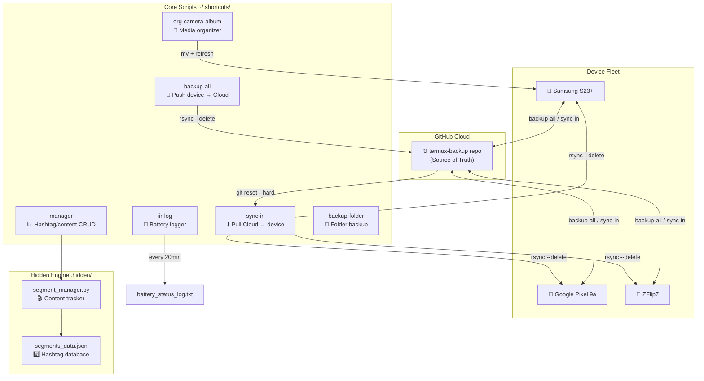

# 📱 termux-backup
### Multi-Device Sync Ecosystem — Samuel Dixon

> A robust, distributed workflow for managing Termux scripts and environment configs across multiple Android devices using a **shadow repository** strategy and GitHub as the single source of truth.


---

## 📐 System Architecture

```
┌─────────────────────────────────────────────────────────────────┐
│                          DEVICES                                │
│   Samsung S23+        Google Pixel 9a          ZFlip7           │
│   (Primary)           (Secondary)              (Tertiary)       │
└──────────┬──────────────────┬───────────────────┬───────────────┘
           │  backup-all  ▲   │                   │
           │  sync-in     ▼   │                   │
           └──────────────┴───┴───────────────────┘
                          │
               ┌──────────▼──────────┐
               │     GitHub Repo     │  ← Single Source of Truth
               │  .shortcuts/        │
               │  .bashrc            │
               │  .hidden/           │
               │    segments_data    │
               │    sync_history.csv │
               └─────────────────────┘
```

Unlike standard backups, this system enforces a **1:1 bidirectional mirror** via `rsync --delete`:
- **`backup-all`** — pushes local state to cloud, including deletions
- **`sync-in`** — forces local state to exactly match cloud, purging ghost files

---

## 🛠 Scripts & Components

### Core Scripts (`~/.shortcuts/`)

| Script | Language | Description |
|--------|----------|-------------|
| `backup-all` | Shell | `rsync --delete` from `~/.shortcuts` → `~/termux-backup`, then `git add/commit/push` |
| `sync-in` | Shell | `git reset --hard` + `rsync --delete` to force device state to match cloud |
| `manager` | Python | CRUD interface for the Content Segment database |
| `org-camera-album` | Shell | Automates movement and gallery refresh of raw media files |
| `iir-log` | Shell | Background service logging battery telemetry to CSV |

### Data Layer (`.hidden/`)

| File | Description |
|------|-------------|
| `segments_data.json` | Central DB: video series counters and optimized hashtag groups |
| `segment_manager2.py` | Logic engine for metadata consistency across all 3 devices |
| `sync_history.csv` | Audit log of sync operations and battery telemetry |

---

## 🔄 Sync Lifecycle

```
[Edit script on any device]
        │
        ▼
  run backup-all
  rsync --delete ~/.shortcuts → ~/termux-backup
  git add -A && git commit && git push
        │
        ▼
   GitHub (authoritative state)
        │
        ▼
  run sync-in on other devices
  git reset --hard origin/main
  rsync --delete ~/termux-backup → ~/.shortcuts
        │
        ▼
  All 3 devices mirror cloud exactly ✓
```

---

## 📊 System Architecture Diagram


```mermaid
flowchart TB
    subgraph "Device Fleet"
        S23["📱 Samsung S23+"]
        Pixel["📱 Google Pixel 9a"]
        ZFlip["📱 ZFlip7"]
    end

    subgraph "GitHub Cloud"
        Repo["🌐 termux-backup repo<br/>(Source of Truth)"]
    end

    subgraph "Core Scripts ~/.shortcuts/"
        BA["backup-all<br/>🔄 Push device → Cloud"]
        SI["sync-in<br/>⬇️ Pull Cloud → device"]
        MGR["manager<br/>📊 Hashtag/content CRUD"]
        CAM["org-camera-album<br/>📁 Media organizer"]
        IIR["iir-log<br/>🔋 Battery logger"]
        BU["backup-folder<br/>💾 Folder backup"]
    end

    subgraph "Hidden Engine .hidden/"
        SEG["segment_manager.py<br/>🎬 Content tracker"]
        DATA["segments_data.json<br/>#️⃣ Hashtag database"]
    end

    S23 <-->|"backup-all / sync-in"| Repo
    Pixel <-->|"backup-all / sync-in"| Repo
    ZFlip <-->|"backup-all / sync-in"| Repo

    BA -->|"rsync --delete"| Repo
    Repo -->|"git reset --hard"| SI
    SI -->|"rsync --delete"| S23
    SI -->|"rsync --delete"| Pixel
    SI -->|"rsync --delete"| ZFlip

    MGR --> SEG
    SEG --> DATA
    CAM -->|"mv + refresh"| S23
    IIR -->|"every 20min"| battery_log["battery_status_log.txt"]
```

### Script Reference Table

| Script | Purpose | Direction |
|--------|---------|-----------|
| `backup-all` | Mirrors local → GitHub, deletes cloud files you deleted locally | ↑ Push |
| `sync-in` | Force-resets local to match GitHub exactly (destructive pull) | ↓ Pull |
| `manager` | Python CRUD for content segments & hashtag groups | 📊 Data |
| `org-camera-album` | Moves camera photos to named folders + refreshes gallery | 📁 Media |
| `iir-log` | Background battery logger (temp, voltage, health) every 20min | 🔋 Monitor |
| `backup-folder` | One-off folder backups | 💾 Archive |

## 🚀 Deployment

### Prerequisites

```bash
pkg install rsync git termux-api python jq
```

### Fresh Device Setup

```bash
# Clone the repo
git clone https://github.com/SamuelDixxon/termux-backup.git ~/termux-backup

# Sync scripts to shortcuts directory
rsync -av --delete ~/termux-backup/.shortcuts/ ~/.shortcuts/

# Source environment
cp ~/termux-backup/.bashrc ~/.bashrc && source ~/.bashrc
```

### Daily Usage

```bash
# Push local changes to cloud
backup-all

# Pull cloud state to this device
sync-in
```

---

## ⚠️ Known Risks & Mitigations

**Concurrent edits** — editing on two devices before syncing will cause a `git merge` conflict. `sync-in` uses `git reset --hard` which will overwrite one set of changes silently. Recommended mitigation: always run `sync-in` before editing on a new device.

**Git credentials** — ensure you are using SSH keys or a git credential manager. Do not store tokens in `.bashrc` as this repo is public.

**`.hidden/` visibility** — verify that `segments_data.json` and related content metadata are intentionally public or excluded via `.gitignore`.

---

## 📁 Repository Structure

```
termux-backup/
├── .shortcuts/
│   ├── backup-all          # Push local → cloud
│   ├── sync-in             # Pull cloud → local
│   ├── manager             # Content segment CRUD
│   ├── org-camera-album    # Media file organizer
│   └── iir-log             # Battery telemetry logger
├── .hidden/
│   ├── segments_data.json  # Content metadata DB
│   └── segment_manager2.py # Metadata logic engine
├── .bashrc                 # Environment config
├── sync_history.csv        # Sync audit log
└── README.md
```

---

## 🔭 Roadmap

- [ ] Add `bootstrap.sh` for one-command fresh device setup
- [ ] Tag sync entries in `sync_history.csv` with device identifier
- [ ] Consolidate `segment_manager2.py` → `segment_manager.py`
- [ ] Add GitHub Actions `shellcheck` workflow for script linting
- [ ] Battery telemetry matplotlib dashboard from `iir-log` data

---

## 👤 Author

**Samuel Dixon** — Electrical Engineer · [sdixoninvesting@gmail.com](mailto:sdixoninvesting@gmail.com)

[](https://github.com/SamuelDixxon)
