# termux-backup · Content Pipeline


A session-driven, multi-source content pipeline running entirely on Android via Termux.
No laptop. No cloud subscription. 25 min manual post-shoot workflow reduced to under 4 min automated.

> Built by **Samuel Dixon** -- Product Test Engineer, Austin TX
> linktr.ee/sdixoninvesting -- @sdixoninvesting

---

## Why This Project

This started as a personal content pipeline and became a running exercise in
the same discipline I used in semiconductor product/test engineering,
applied to consumer Android hardware instead of a DUT:

- **System design** -- a 5-stage pipeline (capture routing -> zip archival ->
  cross-device sync -> metadata tagging -> long-term storage) with a shared
  JSON schema (`segments_data.json`) as the single source of truth every
  stage reads and writes.
- **Automation, not scripts** -- Bash/Python tooling that moves files,
  drives `ffmpeg` for thumbnail labeling and video composition, manages
  clipboard/metadata state, and talks to Android's dialog/media APIs
  through Termux, with no laptop or cloud service involved.
- **Debugging methodology** -- most of the real engineering here happened
  in a string of `set -x` trace-driven debugging sessions that found and
  fixed actual production bugs: a classic bash argument-parsing footgun
  (`for arg in "$@"` desyncing from `shift`), a silent-failure anti-pattern
  that made every ffmpeg error look identical to success, a process hang
  caused by ffmpeg's own interactive stdin listener, and race conditions
  specific to Android's FUSE-mounted shared storage. See
  [Known Issues Fixed This Pass](#known-issues-fixed-this-pass) for the
  full list, kept honest rather than cleaned up after the fact.
- **Cross-device empirical testing** -- `hwbench` runs an identical test
  matrix (software vs. MediaCodec hardware encode/decode, N repeated
  trials, mean/stdev) on a Samsung Exynos device and a Google Tensor
  device, producing comparable CSVs instead of trusting vendor claims or
  forum reports.
- **Process improvement, measured** -- the original manual post-shoot
  workflow (25 minutes) is now under 4 minutes automated, and every
  refactor in this repo's history exists because duplicating logic across
  files caused real bugs to go half-fixed -- consolidated to single
  sources of truth once that became clear.

---

## Table of Contents

- [Why This Project](#why-this-project)
- [Architecture](#architecture)
- [Data Flow](#data-flow)
- [Pipeline v3 (current)](#pipeline-v3-current)
- [Pipeline v4 (proposed)](#pipeline-v4-proposed)
- [Pipeline v5 (proposed) -- burn integration](#pipeline-v5-proposed----burn-integration)
- [Component Deep Dives](#component-deep-dives)
  - [batch-backup](#batch-backup)
  - [segment_manager](#segment_manager)
  - [z_backup internals](#z_backup-internals)
  - [org-camera-album](#org-camera-album)
  - [burn_thumb.sh / mkshot_burn / org-camera-album-burn](#burn_thumbsh--mkshot_burn--org-camera-album-burn)
  - [tapestry / sandwich / video-utils.sh](#tapestry--sandwich--video-utilssh)
  - [hwbench](#hwbench)
- [Voice Control (proposed)](#voice-control-proposed)
- [Storage Zones](#storage-zones)
- [Utility Functions](#utility-functions)
- [Installation](#installation)
- [Dependencies](#dependencies)
- [Raspberry Pi Setup](#raspberry-pi-setup)
- [Known Issues Fixed This Pass](#known-issues-fixed-this-pass)
- [Changelog](#changelog)

---

## Architecture

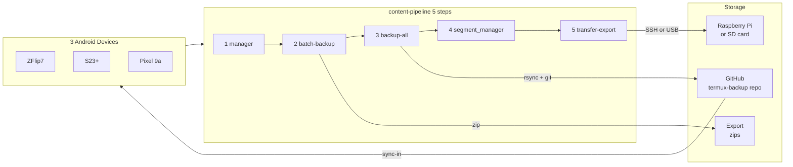
```mermaid
flowchart LR
    subgraph devices [3 Android Devices]
        D1[ZFlip7]
        D2[S23+]
        D3[Pixel 9a]
    end

    subgraph pipeline [content-pipeline 5 steps]
        P1[1 manager]
        P2[2 batch-backup]
        P3[3 backup-all]
        P4[4 segment_manager]
        P5[5 transfer-export]
    end

    subgraph storage [Storage]
        G[GitHub
termux-backup repo]
        E[Export
zips]
        R[Raspberry Pi
or SD card]
    end

    devices --> pipeline
    P1 --> P2 --> P3 --> P4 --> P5
    P3 -->|rsync + git| G
    P2 -->|zip| E
    P5 -->|SSH or USB| R
    G -->|sync-in| devices
```

---

## Data Flow

Which component reads and writes which storage location -- the dependency
graph underneath the step sequence above.

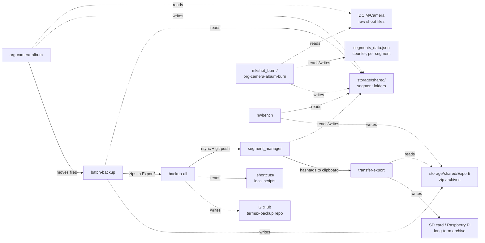
```mermaid
flowchart LR
    OCA[org-camera-album] -.reads.-> DCIM[DCIM/Camera
raw shoot files]
    OCA -.writes.-> SEG[storage/shared/
segment folders]
    OCA -->|moves files| BB[batch-backup]

    BB -.reads.-> SEG
    BB -->|zips to Export/| BA[backup-all]
    BB -.writes.-> ZIP[storage/shared/Export/
zip archives]

    BA -->|rsync + git push| MGR[segment_manager]
    BA -.reads.-> SC[.shortcuts/
local scripts]
    BA -.writes.-> GH[GitHub
termux-backup repo]

    MGR -.reads/writes.-> SEG
    MGR -->|hashtags to clipboard| TE[transfer-export]

    TE -.reads.-> ZIP
    TE -.writes.-> PI[SD card / Raspberry Pi
long-term archive]

    BURN[mkshot_burn /
org-camera-album-burn] -.reads.-> DCIM
    BURN -.reads/writes.-> SD[segments_data.json
counter, per segment]
    BURN -.writes.-> SEG

    HWB[hwbench] -.reads.-> SEG
    HWB -.writes.-> ZIP
```

`segments_data.json` is the one piece of shared state almost everything
touches -- `segment_manager`, the burn tooling, and `seg_add`/`seg_set_counter`/
`seg_bump` in `.bashrc` all read and write the same file, matched by `name`
in its `segments` list (not a dict keyed by segment, which an earlier draft
of the burn tooling guessed wrong on).

---

## Pipeline v3 (current)

The current 5-step post-shoot workflow. Run with one command:

```bash
bash ~/.shortcuts/content-pipeline
```

At step 2 you choose backup mode: `y` = batch-hot (default), `c` = custom select, `n` = single folder.

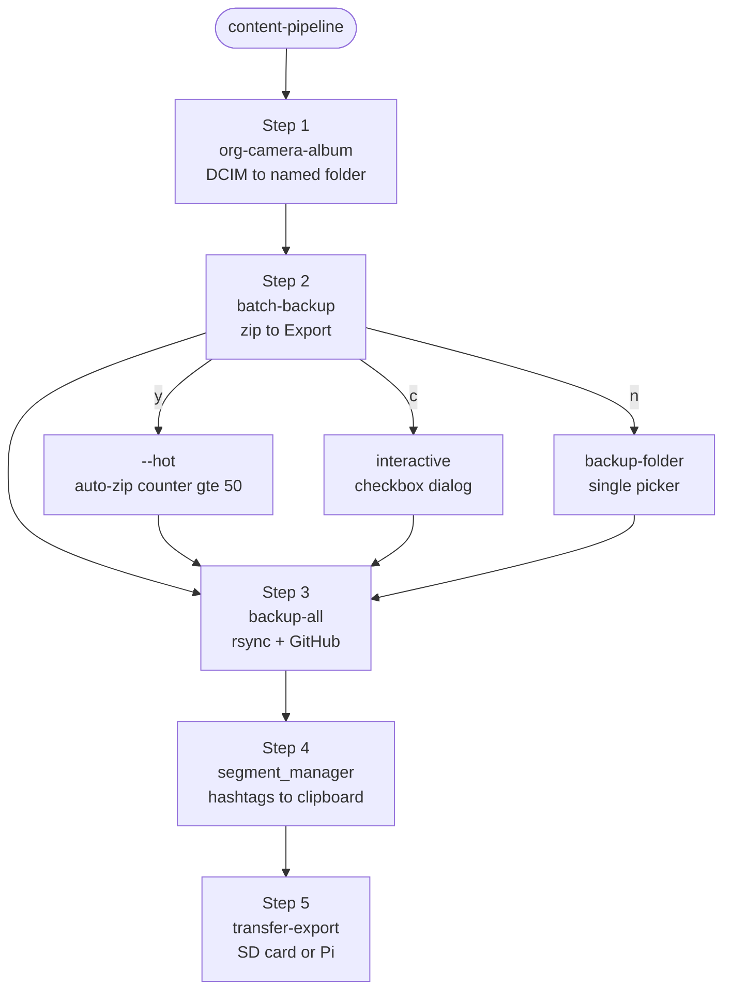
```mermaid
flowchart TD
    START([content-pipeline]) --> S1

    S1[Step 1
org-camera-album
DCIM to named folder]
    S2[Step 2
batch-backup
zip to Export]
    S3[Step 3
backup-all
rsync + GitHub]
    S4[Step 4
segment_manager
hashtags to clipboard]
    S5[Step 5
transfer-export
SD card or Pi]

    S1 --> S2
    S2 --> S3
    S3 --> S4
    S4 --> S5

    S2 -->|y| HOT[--hot
auto-zip counter gte 50]
    S2 -->|c| CUSTOM[interactive
checkbox dialog]
    S2 -->|n| SINGLE[backup-folder
single picker]

    HOT --> S3
    CUSTOM --> S3
    SINGLE --> S3
```

---

## Pipeline v4 (proposed)

Key change: `segment_manager` moves to **step 1** so the selected segment name
flows via `session.json` into every downstream step. No duplicate prompts.


```mermaid
flowchart TD
    subgraph session [Shared Session State]
        SJ[session.json
segment + counter + mode]
    end

    subgraph sources [Media Sources - org-collect NEW]
        S1[DCIM/Camera]
        S2[Instagram Edits]
        S3[Quick Share BLE]
        S4[Downloads]
        S5[Screenshots]
    end

    subgraph modes [Folder Naming Mode]
        M1[incremental
pistol/ skip/]
        M2[episode
m111/ mcp99/]
        M3[dated
hike_20260615/]
    end

    P1([1 segment_manager
pick segment + mode]) -->|writes| SJ
    P2([2 org-collect NEW
gather all sources])
    P3([3 batch-backup
zip to Export])
    P4([4 backup-all
GitHub sync])
    P5([5 transfer-export
SD or Pi])

    SJ -->|reads| P2
    SJ -->|reads| P3

    S1 & S2 & S3 & S4 & S5 --> P2
    P2 -->|incremental| M1
    P2 -->|episode| M2
    P2 -->|dated| M3
    M1 & M2 & M3 --> P3
    P3 --> P4 --> P5
```

### session.json schema

```json
{
  "segment": "pistol",
  "counter": 181,
  "mode": "incremental",
  "timestamp": "2026-06-15T14:30:00"
}
```

| mode | folder | use case |
|------|--------|----------|
| `incremental` | `pistol/` | open-ended series, files accumulate |
| `episode` | `m111/` | numbered series, each shoot discrete |
| `dated` | `hike_20260615/` | one-off or travel content |

---

## Pipeline v5 (proposed) -- burn integration

**Status: design finalized, integration pending `content-pipeline`'s
source.** Step 1 becomes a choice, not a single script: plain
`org-camera-album` (move only, today's behavior, works for any new or
existing folder name) or `org-camera-album-burn` / `mkshot_burn` (move +
sequential thumbnail label + live counter update in `segments_data.json`).
Neither replaces the other -- picking plain keeps the simple free-text
workflow for one-off folders; picking burn requires the segment to already
exist (it needs a counter to burn against).

The building block already exists and is proven: `mkshot_burn` (`mksb`) and
`org-camera-album-burn.sh` have been exercised through several rounds of
real bug fixes this session -- frozen-argument parsing, silent ffmpeg
failures, the ffmpeg interactive-stdin hang, hidden-dotfile and
already-labeled-file exclusion. Wiring the choice into the pipeline is
composition, not new development.

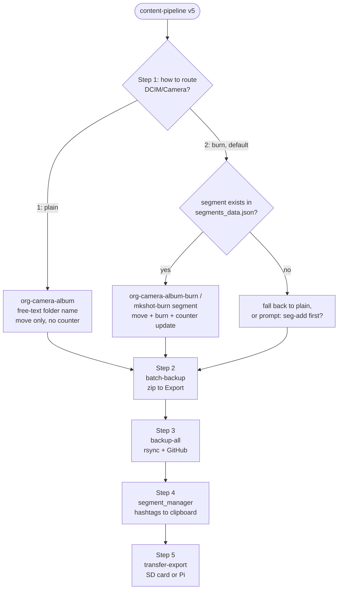
```mermaid
flowchart TD
    START5([content-pipeline v5]) --> S1B

    S1B{Step 1: how to route
DCIM/Camera?}
    S1B -->|1: plain| PLAIN5[org-camera-album
free-text folder name
move only, no counter]
    S1B -->|2: burn, default| BURN5{segment exists in
segments_data.json?}

    BURN5 -->|yes| DOBURN[org-camera-album-burn /
mkshot-burn segment
move + burn + counter update]
    BURN5 -->|no| FALLBACK[fall back to plain,
or prompt: seg-add first?]

    PLAIN5 --> S2
    DOBURN --> S2
    FALLBACK --> S2

    S2[Step 2
batch-backup
zip to Export]
    S3[Step 3
backup-all
rsync + GitHub]
    S4[Step 4
segment_manager
hashtags to clipboard]
    S5[Step 5
transfer-export
SD card or Pi]

    S2 --> S3 --> S4 --> S5
```

**Why step 1, not a separate step:** the burn variants already do the DCIM
move themselves -- each is a superset of what `org-camera-album` does
today, not an addition after it. Slotting the choice in at step 1 (rather
than a new step 1.5) avoids moving the same files twice.

**The one real branch to design carefully:** what happens when someone
picks the burn path for a segment that doesn't exist yet. Two reasonable
options -- silently fall back to plain (safe, but surprising if you
expected labels), or prompt to run `seg-add` inline before continuing
(matches the existing pattern of `batch-backup`'s in-flow `m`/`a`/`s`
prompts). Leaning toward the second: consistent with how the rest of the
pipeline already handles "needs a decision" moments.

**Open question for content-pipeline integration:** does step 1 currently
know the segment name ahead of time, or does the user pick it interactively
mid-step (as `org-camera-album`'s free-text dialog does today)? That
determines whether the choice prompt above happens before or after name
entry. Flagging this now rather than guessing at `content-pipeline`'s
actual prompt flow -- share that script and this becomes a real diff
instead of a design doc.

---

## Component Deep Dives

### batch-backup

Four run modes. The core workhorse of the pipeline.

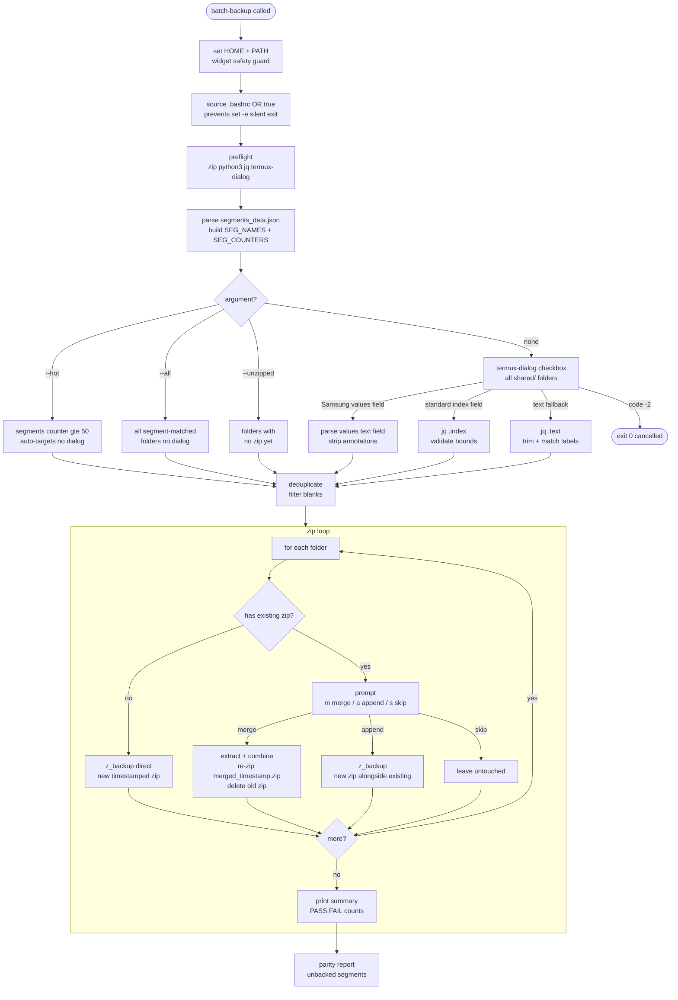
```mermaid
flowchart TD
    LAUNCH([batch-backup called]) --> ENV[set HOME + PATH
widget safety guard]
    ENV --> SRC[source .bashrc OR true
prevents set -e silent exit]
    SRC --> PRE[preflight
zip python3 jq termux-dialog]
    PRE --> PARSE[parse segments_data.json
build SEG_NAMES + SEG_COUNTERS]
    PARSE --> MODE{argument?}

    MODE -->|--hot| HOT[segments counter gte 50
auto-targets no dialog]
    MODE -->|--all| ALL[all segment-matched
folders no dialog]
    MODE -->|--unzipped| UNZ[folders with
no zip yet]
    MODE -->|none| DLG[termux-dialog checkbox
all shared/ folders]

    DLG -->|Samsung values field| VPARSE[parse values text field
strip annotations]
    DLG -->|standard index field| IPARSE[jq .index
validate bounds]
    DLG -->|text fallback| TPARSE[jq .text
trim + match labels]
    DLG -->|code -2| CANCEL([exit 0 cancelled])

    HOT & ALL & UNZ --> TARGETS
    VPARSE & IPARSE & TPARSE --> TARGETS

    TARGETS[deduplicate
filter blanks] --> LOOP

    subgraph LOOP [zip loop]
        F[for each folder] --> HZ{has existing zip?}
        HZ -->|no| ZB[z_backup direct
new timestamped zip]
        HZ -->|yes| PROMPT[prompt
m merge / a append / s skip]
        PROMPT -->|merge| MRG[extract + combine
re-zip merged_timestamp.zip
delete old zip]
        PROMPT -->|append| APP[z_backup
new zip alongside existing]
        PROMPT -->|skip| SKIP[leave untouched]
        ZB & MRG & APP & SKIP --> NEXT{more?}
        NEXT -->|yes| F
        NEXT -->|no| SUMMARY
    end

    SUMMARY[print summary
PASS FAIL counts] --> PARITY[parity report
unbacked segments]
```

**Known issue:** checkbox dialog (`none` mode) confirmed showing on ZFlip7 but
selection not zipping. Root cause: Samsung returns
`values: [{index:N, text:"name"}]` not a flat array. Fix in v3: `parse values text field`.
Status: deployed, awaiting test confirmation. *(Not reviewed this session --
`batch-backup`'s source hasn't been shared, so this status is carried over
unverified.)*

**Merge/append/skip** -- tested and working on ZFlip7. When a folder already
has a zip in Export/, you are prompted:
- `m` merge: extract + combine files + re-zip as single archive
- `a` append: new timestamped zip alongside existing (default)
- `s` skip: leave existing untouched

---

### segment_manager

Python REPL. The counter drives `--hot` targeting in batch-backup passively.

**Corrected this pass:** the clipboard used to output two lines -- a
`<segment><counter>` title line, then hashtags picked per-platform (YouTube
15 tags, Instagram 30, TikTok 10, All 15, each with platform-specific
"booster" tags appended). Both of those were removed on request: the
clipboard now copies **hashtags only**, straight from the segment's own
`hashtags` list in `segments_data.json`, with no platform branching and no
title line.

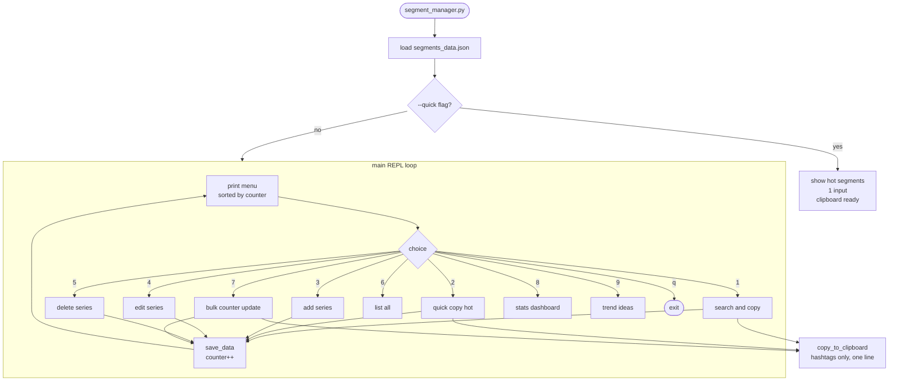
```mermaid
flowchart TD
    LAUNCH2([segment_manager.py]) --> LOAD[load segments_data.json]
    LOAD --> QMODE{--quick flag?}
    QMODE -->|yes| QUICK[show hot segments
1 input
clipboard ready]
    QMODE -->|no| MENU

    subgraph MENU [main REPL loop]
        M0[print menu
sorted by counter] --> INPUT{choice}
        INPUT -->|1| SEARCH[search and copy]
        INPUT -->|2| QUICK2[quick copy hot]
        INPUT -->|3| ADD[add series]
        INPUT -->|4| EDIT[edit series]
        INPUT -->|5| DELETE[delete series]
        INPUT -->|6| LIST[list all]
        INPUT -->|7| BULK[bulk counter update]
        INPUT -->|8| STATS[stats dashboard]
        INPUT -->|9| TREND[trend ideas]
        INPUT -->|q| QUIT([exit])
        SEARCH & QUICK2 & ADD & EDIT & DELETE & BULK --> SAVE[save_data
counter++]
        SAVE --> M0
    end

    SEARCH & QUICK2 & BULK --> COPY[copy_to_clipboard
hashtags only, one line]
```

**Real `segments_data.json` schema** (list, not a dict keyed by name):

```json
{
  "segments": [
    {
      "id": 19,
      "name": "pistol",
      "short_desc": "pistol squats",
      "full_desc": "pistol squats",
      "counter": 555,
      "hashtags": ["#squats", "#pistolsquats", "#legs", "#calisthenics", "#core"]
    }
  ]
}
```

Every script in the pipeline that touches segment data (`burn_thumb.sh`,
`mkshot_burn`, `org-camera-album-burn.sh`, `seg_add`/`seg_set_counter`/
`seg_bump` in `.bashrc`) matches against this list-by-`name` shape, not a
dict keyed by segment name -- an earlier draft of the burn tooling guessed
wrong on this and had to be corrected once the real file was shared.

---

### z_backup internals

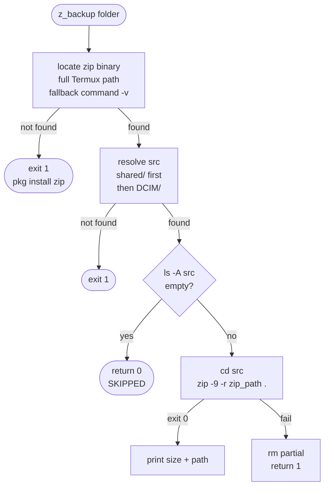
```mermaid
flowchart TD
    IN([z_backup folder]) --> BIN[locate zip binary
full Termux path
fallback command -v]
    BIN -->|not found| FAIL([exit 1
pkg install zip])
    BIN -->|found| RES[resolve src
shared/ first
then DCIM/]
    RES -->|not found| FAIL2([exit 1])
    RES -->|found| EMPTY{ls -A src
empty?}
    EMPTY -->|yes| SKIP2([return 0
SKIPPED])
    EMPTY -->|no| ZIP[cd src
zip -9 -r zip_path .]
    ZIP -->|exit 0| SIZE[print size + path]
    ZIP -->|fail| CLEAN[rm partial
return 1]
```

**Why `zip -r .` not `zip *`:**
The `*` glob fails on empty dirs, skips subdirectories, and errors on
filenames with spaces. `zip -9 -r "$zip_path" .` recurses everything
unconditionally. Exit code 127 = zip binary not in PATH -- fix: `pkg install zip`.

---

### org-camera-album

**Corrected this pass.** The previous version of this doc described a
smart radio-dialog router (hot segments sorted to the top, one-tap
routing, marked "tested" in the changelog). Once the actual script was
shared, that turned out not to match reality -- the real `org-camera-album`
is simpler and **not segment-aware at all**:

```mermaid
flowchart TD
    LAUNCH3([org-camera-album]) --> CHECK{DCIM/Camera
exists?}
    CHECK -->|no| FAIL3([exit 1
run termux-setup-storage])
    CHECK -->|yes| DIALOG[termux-dialog text
"Enter NEW folder name"]
    DIALOG -->|empty| EXIT2([exit 0
nothing entered])
    DIALOG -->|name entered| MKDIR[mkdir -p
shared/name]
    MKDIR --> MOVE[find + xargs mv
mp4/mov/3gp/webm/mkv/jpg/jpeg/png]
    MOVE --> SCAN[termux-media-scan -r
source + destination]
    SCAN --> DONE2([done])
```

It's a free-text prompt for **any** folder name -- new or existing, no
awareness of `segments_data.json`, no counter, no hot-segment sorting. The
segment-aware, counter-tracking variants are `mkshot`/`mkshot_burn` in
`.bashrc` and the standalone `org-camera-album-burn.sh` (see next section) --
those are newer additions layered alongside the original script, not a
replacement for it.

**v4 proposed -- org-collect:** Extends this to pull from 6 sources
(DCIM, Instagram Edits, Quick Share, Downloads, Screenshots, CapCut)
in a single pass, reading destination from `session.json`. Unchanged from
the original proposal; still not built.

---

### burn_thumb.sh / mkshot_burn / org-camera-album-burn

New this session. Burns a sequential text label ("Pistol 554") onto the
first few seconds of each clip in a segment, using `ffmpeg`'s `drawtext`
filter, and keeps `segments_data.json`'s counter in sync automatically.

**Three entry points, one shared core:**

| Entry point | Where | What it does |
|---|---|---|
| `burn_thumb` (`burnthumb`) | `burn_thumb.sh` | Single file, reads label from `session.json` or prompts |
| `burn_thumb_segment` (`burnthumbsegment`) | `burn_thumb.sh` | Batch-burns an already-populated folder |
| `mkshot_burn` (`mksb`) | `.bashrc` | Moves DCIM/Camera into a segment folder **and** burns in one step |
| `org-camera-album-burn.sh` | standalone script | Same as `mkshot_burn`, styled like the original `org-camera-album` (jq-parsed dialog, `set -x`) |

All four call the same `_burn_thumb_core` function, sourced once from
`burn_thumb.sh` -- `.bashrc` no longer keeps its own copy. That
consolidation happened *because* duplicating it caused real bugs: fixes
applied to one copy didn't propagate to the other, and it took a couple of
rounds to notice.

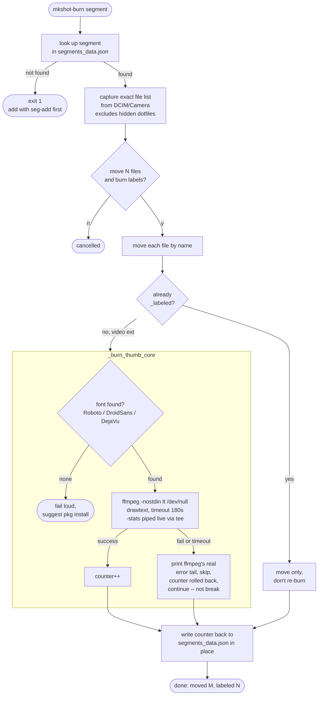
```mermaid
flowchart TD
    LAUNCH4([mkshot-burn segment]) --> LOOKUP[look up segment
in segments_data.json]
    LOOKUP -->|not found| FAIL4([exit 1
add with seg-add first])
    LOOKUP -->|found| CAPTURE[capture exact file list
from DCIM/Camera
excludes hidden dotfiles]
    CAPTURE --> CONFIRM{move N files
and burn labels?}
    CONFIRM -->|n| CANCEL2([cancelled])
    CONFIRM -->|y| MOVELOOP[move each file by name]

    MOVELOOP --> BURNLOOP{already
_labeled?}
    BURNLOOP -->|yes| SKIPLBL[move only,
don't re-burn]
    BURNLOOP -->|no, video ext| CORE

    subgraph CORE [_burn_thumb_core]
        FONT{font found?
Roboto / DroidSans / DejaVu}
        FONT -->|none| FAILFONT([fail loud,
suggest pkg install])
        FONT -->|found| ENCODE[ffmpeg -nostdin lt /dev/null
drawtext, timeout 180s
-stats piped live via tee]
        ENCODE -->|success| OK4[counter++]
        ENCODE -->|fail or timeout| SKIP4[print ffmpeg's real
error tail, skip,
counter rolled back,
continue -- not break]
    end

    OK4 & SKIP4 & SKIPLBL --> WRITEBACK[write counter back to
segments_data.json in place]
    WRITEBACK --> DONE4([done: moved M, labeled N])
```

**Style:** centered on frame, fontsize 120, 6px black border (not the
original bottom-third drop-shadow style).

---

### tapestry / sandwich / video-utils.sh

Originally one dual-mode script (`--concat`/`--grid`); split into two
single-purpose tools after concat (the default mode) produced the wrong
output when the goal was a grid -- one flag you had to remember to pass
was one too many failure modes.

- **`tapestry`** -- NxN grid, all clips playing simultaneously (e.g. "100
  pistol squats in 30 seconds" style posts). Output resolution is
  configurable (`--width`/`--height`, or `--vertical`/`--square`/
  `--landscape` shortcuts) and *forced* to exactly match the target via a
  trailing `scale` filter -- cell size used to be hardcoded at 480x270
  regardless of `--cols`, so the grid never actually filled a phone screen
  when played back.
- **`sandwich`** -- sequential concatenation into one long reel. This is
  the tool for turning a folder of short clips into continuous long-format
  content.
- **`video-utils.sh`** -- shared library both source: clip collection
  (case-insensitive extensions, dotfile exclusion), upfront `ffprobe`
  validation (one corrupt clip no longer takes down a whole grid/concat
  job), numeric-flag sanitizing, and the `-nostdin`/timeout ffmpeg-safety
  pattern established in `burn_thumb.sh`.

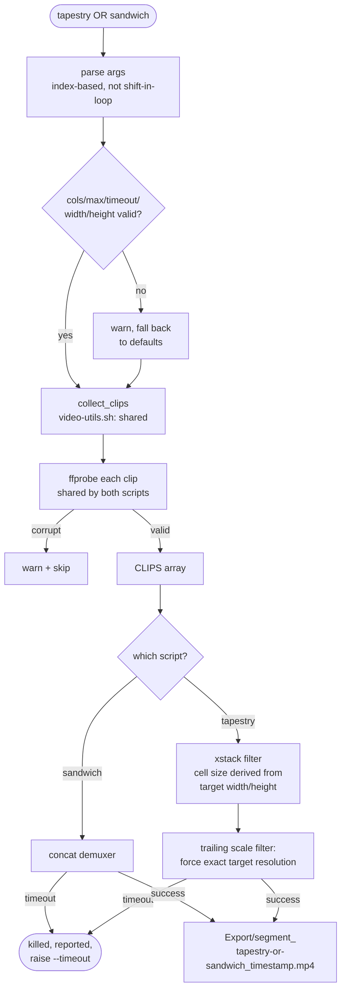
```mermaid
flowchart TD
    LAUNCH5([tapestry OR sandwich <segment>]) --> PARSE5[parse args
index-based, not shift-in-loop]
    PARSE5 --> GUARD5{cols/max/timeout/
width/height valid?}
    GUARD5 -->|no| DEFAULT5[warn, fall back
to defaults]
    GUARD5 -->|yes| COLLECT5[collect_clips
video-utils.sh: shared]
    DEFAULT5 --> COLLECT5

    COLLECT5 --> VALIDATE5[ffprobe each clip
shared by both scripts]
    VALIDATE5 -->|corrupt| WARN5[warn + skip]
    VALIDATE5 -->|valid| CLIPLIST5[CLIPS array]

    CLIPLIST5 --> MODE5{which script?}
    MODE5 -->|tapestry| GRID5[xstack filter
cell size derived from
target width/height]
    MODE5 -->|sandwich| CONCAT5[concat demuxer]

    GRID5 --> FORCE5[trailing scale filter:
force exact target resolution]
    CONCAT5 & FORCE5 -->|timeout| TIMEOUT5([killed, reported,
raise --timeout])
    CONCAT5 & FORCE5 -->|success| SAVE5[Export/segment_
tapestry-or-sandwich_timestamp.mp4]
```

Corrected/hardened this pass: case-sensitive extension matching (`.MP4` was
invisible), no clip validation in grid mode, no timeout protection,
`--cols 0` divide-by-zero, malformed numeric flags crashing instead of
falling back, `--help` as the first argument being swallowed as a segment
name, and the grid-doesn't-fill-the-screen sizing bug. All verified against
a stubbed ffmpeg/ffprobe harness, including a deliberately-hung ffmpeg
confirming the timeout kills it in the configured time rather than the
full hang duration.

---

### hwbench

A test matrix, not a demo: repeated trials of software encode (`libx264`),
hardware encode (`*_mediacodec`), and hardware-decode-plus-software-encode,
run identically on any device. Built to answer a specific question with
data instead of forum anecdotes -- is ffmpeg's MediaCodec hardware
acceleration actually reliable on the ZFlip7 (Exynos) and the Pixel 9a
(Tensor), and is it faster when it works?

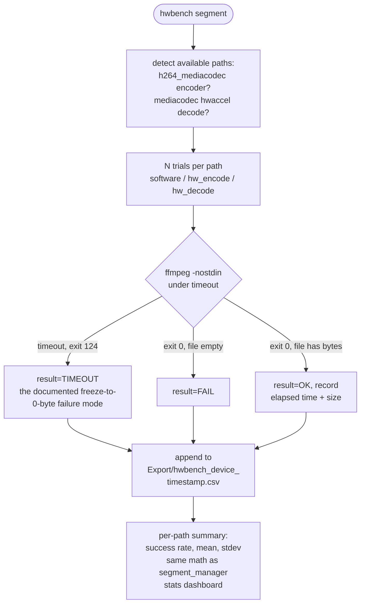
```mermaid
flowchart TD
    LAUNCH6([hwbench segment]) --> DETECT6[detect available paths:
h264_mediacodec encoder?
mediacodec hwaccel decode?]
    DETECT6 --> TRIALS6[N trials per path
software / hw_encode / hw_decode]

    TRIALS6 --> RUN6{ffmpeg -nostdin
under timeout}
    RUN6 -->|timeout, exit 124| T6[result=TIMEOUT
the documented freeze-to-
0-byte failure mode]
    RUN6 -->|exit 0, file empty| F6[result=FAIL]
    RUN6 -->|exit 0, file has bytes| OK6[result=OK, record
elapsed time + size]

    T6 & F6 & OK6 --> CSV6[append to
Export/hwbench_device_
timestamp.csv]
    CSV6 --> STATS6[per-path summary:
success rate, mean, stdev
same math as segment_manager
stats dashboard]
```

**Why this matters beyond the pipeline:** Termux's ffmpeg does ship
MediaCodec hardware acceleration, but real-world reliability is documented
as inconsistent across devices -- working on some, freezing and producing
a 0-byte output on others, decoder dimension bugs reported on certain
Android/chipset combinations. `hwbench` measures what's actually true on
these two specific devices rather than trusting vendor claims. The
`-s "$out"` check (non-empty, not just exists) exists specifically because
the documented failure mode is an `exit 0` with a 0-byte file -- verified
against a stub simulating that exact behavior, plus a genuine hang (2s
timeout, 2s wall-clock, not the full simulated 300s hang).

---

## Voice Control (proposed)

Reduce friction for high-volume daily content. Instead of widget taps
and text input, speak the segment name and command.

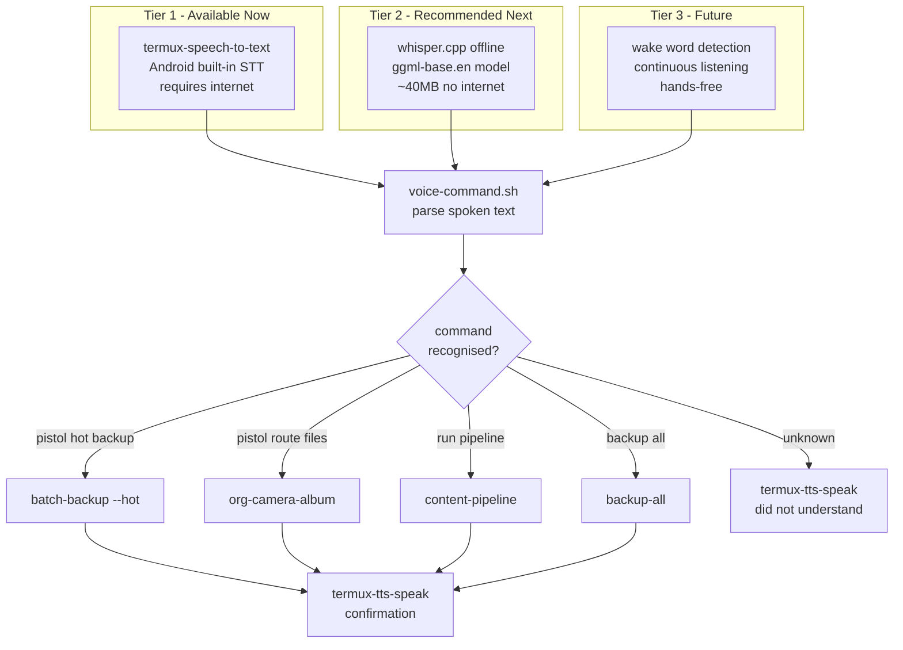
```mermaid
flowchart TD
    subgraph tier1 [Tier 1 - Available Now]
        V1[termux-speech-to-text
Android built-in STT
requires internet]
    end

    subgraph tier2 [Tier 2 - Recommended Next]
        V2[whisper.cpp offline
ggml-base.en model
~40MB no internet]
    end

    subgraph tier3 [Tier 3 - Future]
        V3[wake word detection
continuous listening
hands-free]
    end

    V1 & V2 & V3 --> VSCRIPT[voice-command.sh
parse spoken text]

    VSCRIPT --> VCMD{command
recognised?}
    VCMD -->|pistol hot backup| BBHOT[batch-backup --hot]
    VCMD -->|pistol route files| OCA[org-camera-album]
    VCMD -->|run pipeline| PIPE[content-pipeline]
    VCMD -->|backup all| BALL[backup-all]
    VCMD -->|unknown| TTS[termux-tts-speak
did not understand]

    BBHOT & OCA & PIPE & BALL --> CONFIRM[termux-tts-speak
confirmation]
```

### Tier 1 -- termux-speech-to-text (start here)

Already available if `termux-api` is installed:

```bash
pkg install termux-api

# Test it:
termux-speech-to-text
# speak "pistol hot backup"
# outputs: pistol hot backup
```

### Tier 2 -- whisper.cpp offline (recommended)

Build whisper.cpp on device, download the base.en model (~40MB),
record audio with `ffmpeg`, and transcribe locally without internet.
The ZFlip7's Exynos 2500 handles the base model in under 3 seconds.

```bash
pkg install git cmake clang make ffmpeg
git clone --depth 1 https://github.com/ggerganov/whisper.cpp.git
cd whisper.cpp
cmake -B build && cmake --build build -j4
bash models/download-ggml-model.sh base.en
```

### voice-command.sh (to build)

```bash
#!/data/data/com.termux/files/usr/bin/bash
# Record 3 seconds, transcribe, route to pipeline component
ffmpeg -f android_mic -t 3 /tmp/voice.wav -y 2>/dev/null
WORDS=$(~/whisper.cpp/build/bin/whisper-cli         -m ~/whisper.cpp/models/ggml-base.en.bin         -f /tmp/voice.wav --no-timestamps -otxt 2>/dev/null)

case "${WORDS,,}" in
    *pipeline*)      bash ~/.shortcuts/content-pipeline ;;
    *hot*backup*)    bash ~/.shortcuts/batch-backup --hot ;;
    *route*|*album*) bash ~/.shortcuts/org-camera-album ;;
    *sync*|*github*) bash ~/.shortcuts/backup-all ;;
    *)  termux-tts-speak "Did not understand: $WORDS" ;;
esac
```

### Other efficiency ideas

| Idea | Mechanism | Effort |
|------|-----------|--------|
| Voice-triggered pipeline | `termux-speech-to-text` + keyword routing | Low |
| Offline transcription | `whisper.cpp` base.en model | Medium |
| Auto-route on file detect | `inotifywait` watches DCIM, triggers org-camera-album | Medium |
| Garmin/Strava auto-tag | Parse .fit file date, match to segment folder by timestamp | Medium |
| Batch post scheduler | Write post queue to JSON, cron job copies hashtags at scheduled times | Medium |
| Wear OS / Galaxy Watch | Tap watch face to trigger widget shortcuts via Bluetooth | High |

---

## Storage Zones

| Zone | Path | Access | Notes |
|------|------|--------|-------|
| Termux home | `~/` | Full POSIX | Scripts, config, git repos |
| Shared storage | `~/storage/shared/` | FUSE-mounted | Camera roll, segments, Export |
| DCIM | `~/storage/shared/DCIM/Camera/` | FUSE + MediaStore | Raw shoot files |
| Export | `~/storage/shared/Export/` | FUSE | Canonical zip output |

**FUSE gotcha:** `zip *` silently fails inside DCIM. Always use absolute
paths and `zip -r .` from inside the source folder.

**Samsung Android 16 gotcha:** `find -not -path` returns empty results.
Use bash `[[ "$f" == .* ]]` inside the loop instead.

**MediaStore trash gotcha (new this pass):** files pending write or marked
trashed by Android show up as hidden dotfiles (`.20260410_233635.mp4`) and
are usually corrupt/incomplete (`moov atom not found` from ffmpeg). Every
`find` in the burn/tapestry tooling now excludes them with `! -name '.*'`.
Run `empty-gallery-trash` periodically to clear them out for good.

---

## Utility Functions (.bashrc)

| Function | Alias | Purpose |
|----------|-------|---------|
| `z_backup folder` | `zb` | Zip named folder to Export/ |
| `z_restore folder` | `zr` | Restore newest zip back to shared/ (now re-scans media after restore -- previously left restored files invisible to the Gallery until the next automatic scan) |
| `clean_termux` | `clean-termux` | Clean 5 junk zones (apt cache, trash, pip, tmp) |
| `empty_gallery_trash` | `empty-gallery-trash` | Remove Android MediaStore trash bypass 30-day hold |
| `seg_status` | `segstat` | Table: all segments with counter, folder exists, zipped |
| `export_summary` | `exsum` | List all zips in Export/ with sizes and dates |
| `seg_add name desc tags` | `segadd` | Add segment without opening REPL |
| `seg_set_counter name N` | `segset` | Set a segment counter directly (mass-upload sync) |
| `seg_bump name [N]` | `segbump` | Increment a segment counter by N (default 1) |
| `mkshot name` | `mks` | Create segment folder + optionally move DCIM files (not burn-aware) |
| `mkshot_burn name` | `mksb` | Same as `mkshot`, plus burns sequential labels and updates the counter |
| `pkg_check` | `pkgcheck` | Verify all required packages installed |
| `termux_info` | `tinfo` | One-screen: battery, WiFi, storage, segment count |
| `lsclip path` | `lsc` | List folder tree + copy to clipboard for sharing |
| `debug_folder name` | `dbf` | Full audit: permissions, file types, zip status, segment match |
| `gc_empty` | `gcempty` | Remove empty dirs from shared/ (GUI-deleted folders) |
| `extract_audio file` | `extractaudio` | Pull audio track out of a video |
| `probe_media file` | `probe` | Print codec/resolution/duration/bitrate |
| `compress_vid file` | `compvid` | Re-encode for smaller upload size |
| `waveform_img file` | `waveform` | Generate a waveform PNG from audio |

**Sourced, not duplicated:** `burn_thumb`, `burn_thumb_segment`, and
`_burn_thumb_core` are no longer defined in `.bashrc` -- it sources
`~/.shortcuts/burn_thumb.sh` instead, which is the single canonical copy.
`tapestry` and `sandwich` follow the same pattern: `.bashrc` just aliases
to `~/.shortcuts/tapestry` and `~/.shortcuts/sandwich`.

**Per-segment `cd` aliases (dynamic):** at shell start, `.bashrc` reads
`segments_data.json` and generates a plain alias for every segment name --
type `pistol` and you're in `~/storage/shared/pistol`. Generated fresh
every session, not hardcoded, so it stays in sync as segments are added or
renamed. Collision-safe: any segment name that's already a real command,
function, or alias (the `code` segment, for instance, would otherwise
silently shadow an actual `code` CLI) gets skipped and reported at shell
start instead of overwritten.

### Pipeline shortcuts

```bash
pipeline    # full 5-step content-pipeline
bb          # batch-backup interactive
bbhot       # batch-backup --hot
bball       # batch-backup --all
bbunzipped  # batch-backup --unzipped
mgr         # segment_manager.py
quick       # segment_manager.py --quick
syncup      # backup-all
transfer    # transfer-export
tapestry    # bash ~/.shortcuts/tapestry (grid)
sandwich    # bash ~/.shortcuts/sandwich (concat)
hwbench     # bash ~/.shortcuts/hwbench (cross-device benchmark)
segstat     # segment status table
exsum       # export summary
```

---

## Installation

```bash
pkg update && pkg install git rsync python jq zip termux-api ffmpeg coreutils
termux-setup-storage
git clone https://github.com/SamuelDixxon/termux-backup ~/termux-backup
cp ~/termux-backup/.shortcuts/* ~/.shortcuts/
cp ~/termux-backup/.bashrc ~/.bashrc
source ~/.bashrc
chmod +x ~/.shortcuts/*
```

`coreutils` added to the base install: the burn/tapestry timeout
protection depends on the `timeout` binary, which isn't guaranteed present
on a minimal Termux install.

---

## Dependencies

| Package | Install | Used by |
|---------|---------|---------|
| `zip` | `pkg install zip` | z_backup, batch-backup |
| `python3` | `pkg install python` | segment_manager, batch-backup, seg_add/seg_set/seg_bump |
| `jq` | `pkg install jq` | batch-backup, backup-folder, org-camera-album-burn.sh |
| `rsync` | `pkg install rsync` | backup-all, transfer-export |
| `git` | `pkg install git` | backup-all, sync-in |
| `termux-api` | `pkg install termux-api` | dialogs, clipboard, media-scan |
| `openssh` | `pkg install openssh` | transfer-export Pi SSH |
| `ncftp` | `pkg install ncftp` | transfer-export FTP fallback |
| `ffmpeg` | `pkg install ffmpeg` | burn_thumb.sh, tapestry -- **live now**, not just planned |
| `coreutils` | `pkg install coreutils` | `timeout` binary, used for hang protection in burn_thumb.sh + tapestry |
| a real `.ttf` font | `pkg install dejavu-fonts-ttf` | burn_thumb.sh's drawtext label -- fails loud now if none found |

---

## Raspberry Pi Setup

```bash
# On Pi:
sudo apt install rsync openssh-server -y
sudo systemctl enable ssh && sudo systemctl start ssh
# Set static IP in /etc/dhcpcd.conf:
#   static ip_address=192.168.1.100/24

# From Termux:
ssh-keygen -t ed25519
ssh-copy-id pi@192.168.1.100

# Update transfer-export config:
PI_USER="pi"
PI_IP="192.168.1.100"
PI_DEST="/home/pi/sd-archive"
```

---

## Known Issues Fixed This Pass

A real debugging arc, not a feature list -- kept honest for anyone (human
or future Claude session) who touches this code next.

| Bug | Symptom | Fix |
|---|---|---|
| `for arg in "$@"; do ... shift ... done` | Frozen argument list desyncs from live `shift` -- second flag grabbed the wrong value (`--dur 3` came out as the literal string `"--dur"`) | Rewrote as `while [ $# -gt 0 ]` consuming `$1`/`$2` directly, in `burn_thumb`, `burn_thumb_segment`, `mkshot_burn`, `tapestry` |
| ffmpeg `2>/dev/null` | Every failure looked identical to success -- silent, no diagnostic info, indistinguishable from a hang | Capture to a log + print `tail -n 6` on failure; live progress restored via `tee` |
| ffmpeg's interactive stdin listener | Encode would progress normally, then hang forever at an `Enter command:` prompt | Added `-nostdin` and `< /dev/null` to every ffmpeg invocation |
| `break` on first burn failure | One bad clip aborted the entire batch; every clip after it silently never got processed | Changed to skip-and-continue in `burn_thumb_segment`, `mkshot_burn`, `org-camera-album-burn.sh` |
| Hidden dotfiles swept into batches | Android trash/pending files (`.20260410_233635.mp4`) have no valid moov atom, fail with a cryptic ffmpeg error | `find ... ! -name '.*'` excludes them everywhere in the burn/tapestry tooling |
| Already-labeled files re-matched | Files with `_labeled` already in the name got re-burned into `_labeled_labeled` cascades | `find ... ! -iname '*_labeled.*'` excludes them |
| Duplicated implementation | `.bashrc` kept its own copy of `_burn_thumb_core`/`tapestry`; fixes applied to one copy didn't propagate to the other | Consolidated to single source of truth per script; `.bashrc` sources/aliases instead of duplicating |
| Wrong schema guess | Early burn tooling guessed `segments_data.json` was a dict keyed by segment name; it's actually a list matched by `name` field | Corrected once the real file was shared; all burn scripts now match the real shape |
| Case-sensitive extension matching (`tapestry`) | Clips with uppercase extensions (`.MP4`) were invisible to `find` | Switched to `-iname` |
| No clip validation in grid mode (`tapestry`) | One corrupt clip failed the entire `xstack` job instead of just being skipped | Validation now runs once upfront, shared by both `--concat` and `--grid` |
| `--cols 0` | Divide-by-zero crash | Guarded, falls back to default (2) with a warning |
| Grid cell size hardcoded (480x270) | Output resolution had no relationship to `--cols` or how it'd be viewed -- grid never filled a phone screen | Cell size now derived from a configurable target resolution (default 1080x1920 vertical); a trailing `scale` filter forces the exact target regardless of integer-division rounding |
| `--help` as first argument | Swallowed as the segment name instead of showing help, in both `tapestry` and `sandwich` | Checked for `--help`/`-h` across all args before `$1` is ever assigned to `SEGMENT` |
| Malformed `--max`/`--timeout` values | `head -` (invalid) or silent bad state | Guarded, falls back to defaults with a warning |

---

## Changelog

| Version | Date | Component | Status | Summary |
|---------|------|-----------|--------|---------|
| v3.5 | 2026-07 | hwbench | new | Cross-device ffmpeg hardware-vs-software benchmark harness -- N trials per path, CSV output, mean/stdev summary. Verified against a stub simulating both documented real-world MediaCodec failure modes (fast failure and the freeze-to-0-byte hang) |
| v3.4 | 2026-07 | tapestry / sandwich | tested | Split the dual-mode `tapestry` into two single-purpose scripts (`tapestry`=grid, `sandwich`=concat) sharing `video-utils.sh`. Fixed: grid output not filling the screen (cell size now derived from a configurable target resolution, forced exact via trailing scale), `--help` swallowed as a segment name when passed first |
| v3.3 | 2026-07 | tapestry | tested | Rewritten: case-insensitive extensions, upfront clip validation (both modes), `-nostdin`/timeout protection, guarded `--cols`/`--max`/`--timeout`. Verified against a stubbed ffmpeg/ffprobe harness including a deliberate hang test |
| v3.2 | 2026-07 | burn_thumb.sh / mkshot_burn | tested | New: sequential thumbnail labeling with live counter tracking. Multiple real bugs found and fixed via `set -x` trace debugging: frozen-arg-list parsing, silent ffmpeg failures, interactive-stdin hang, batch-aborting `break`, dotfile/relabel exclusion, duplicated-implementation drift |
| v3.2 | 2026-07 | .bashrc | tested | Dynamic per-segment `cd` aliases generated from `segments_data.json` (collision-checked against existing commands); `z_restore`/`zr` now re-scans media after restore instead of leaving files invisible to the Gallery |
| v3.1 | 2026-06 | batch-backup | partial | Samsung `values` field parsing fix for checkbox dialog *(carried over, not reviewed this session)* |
| v3.0 | 2026-06 | batch-backup | partial | Merge/append/skip logic -- merge tested working *(carried over, not reviewed this session)* |
| v3.0 | 2026-06 | batch-backup | partial | Full inline documentation + Android 16 find fix *(carried over, not reviewed this session)* |
| v2.1 | 2026-06 | backup-all | deployed | sync_history.csv logging on every run *(carried over, not reviewed this session)* |
| v2.0 | 2026-07 | segment_manager | corrected | Clipboard simplified to hashtags-only -- removed per-platform hashtag generation and the `<segment><counter>` title line |
| v2.0 | 2026-05 | segment_manager | tested | *(superseded above)* Combined clipboard: title+hashtags, --quick mode, platform modes |
| v2.0 | 2026-07 | org-camera-album | doc-corrected | This README previously described a segment-aware radio-dialog router; the real script is a simple free-text-name mover with no segment awareness. Doc corrected to match; segment-aware behavior lives in `mkshot`/`mkshot_burn` instead |
| v2.0 | 2026-05 | org-camera-album | tested | *(doc corrected above)* Smart auto-router: hot segments first, one-tap routing |
| v2.0 | 2026-05 | batch-backup | partial | All-folders dialog, Samsung cancel detection, HOME/PATH guard *(carried over, not reviewed this session)* |
| v1.0 | 2026-04 | content-pipeline | tested | Initial 5-step pipeline, --hot working across ZFlip7 |

### Known issues (carried over, unverified this session)

- `batch-backup` interactive checkbox: dialog shows and folders listed correctly.
  Confirm button triggers cancel. Fix deployed (v3.1 `parse values text field`).
  **Needs test confirmation on ZFlip7.**
- `transfer-export` wireless path: untested. Blocked on Pi physical access
  (micro HDMI cable ordered).
- `org-collect` multi-source gatherer: not yet built. Blocked on confirming
  Instagram Edits and Quick Share paths on device.
- **v5 burn integration** (this doc's new proposal): not built. Needs
  `content-pipeline`'s actual source before it can be wired in for real.

---

## Author

**Samuel Dixon** -- Product Test Engineer -- Austin TX
[linktr.ee/sdixoninvesting](https://linktr.ee/sdixoninvesting)

*Outdoors -- Tech -- Fitness -- Education*
