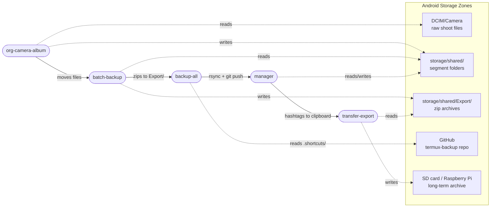
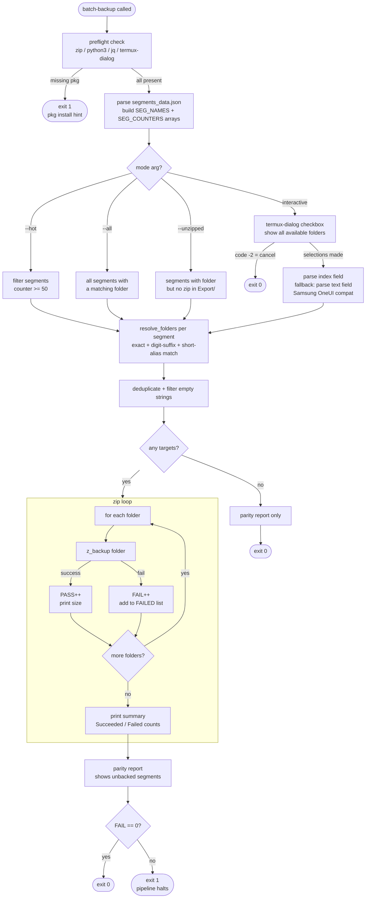
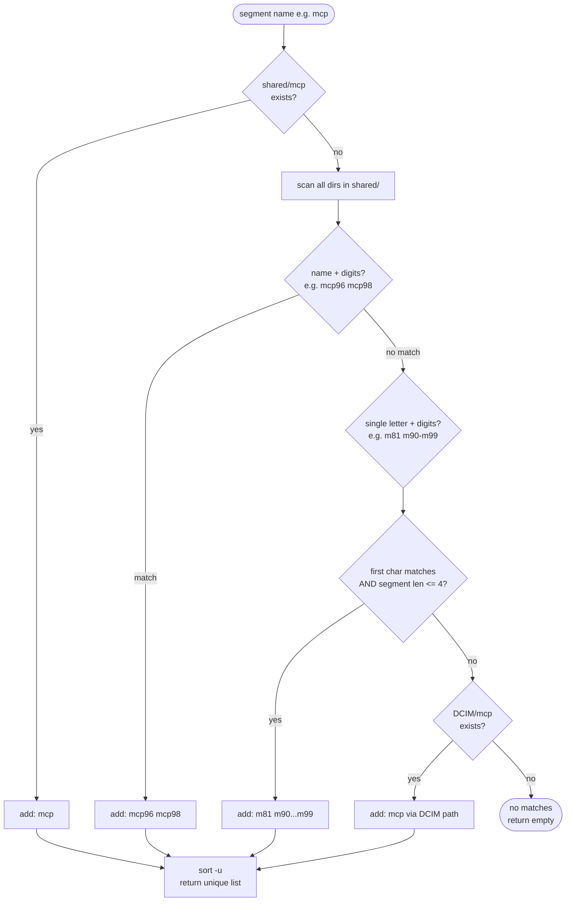
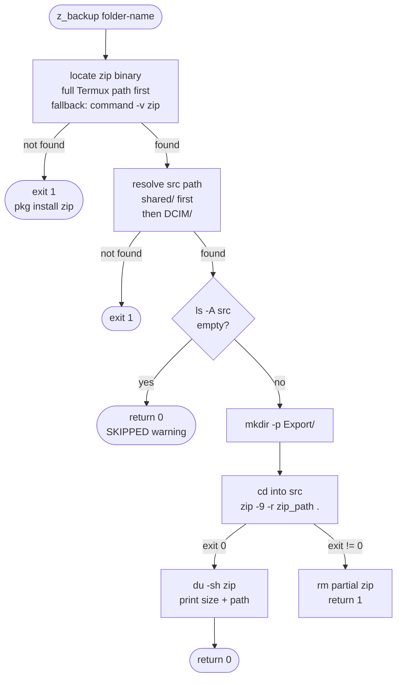
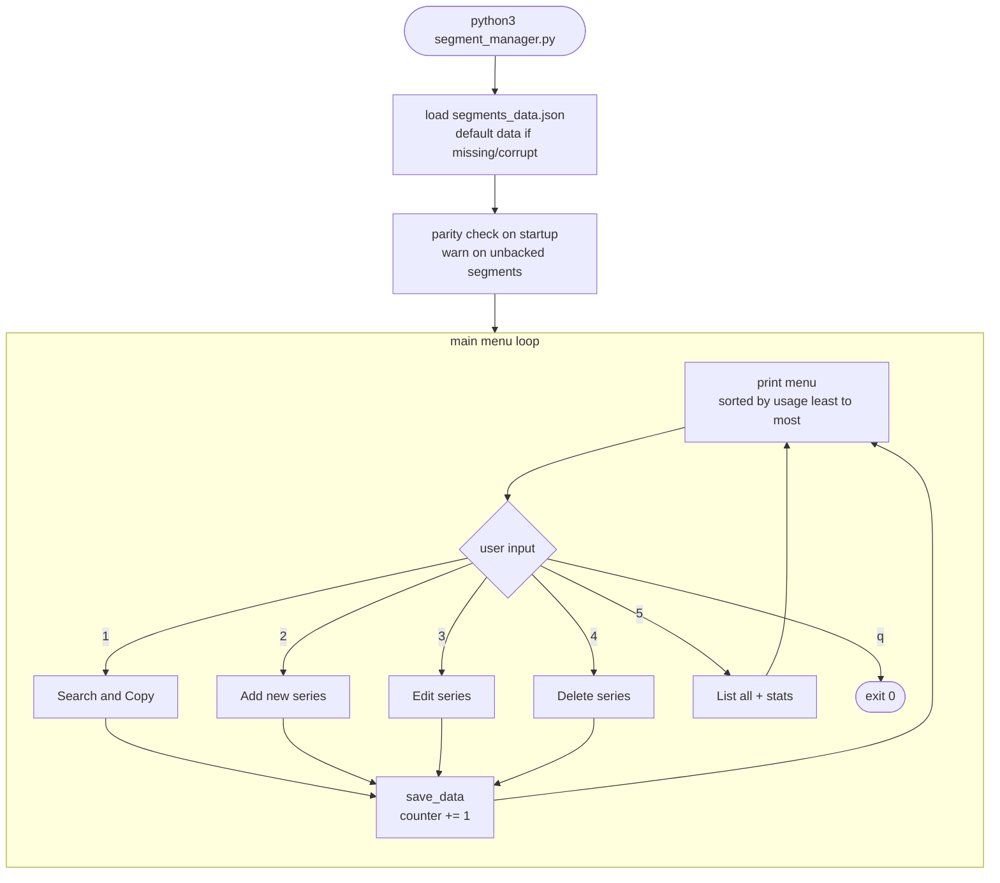
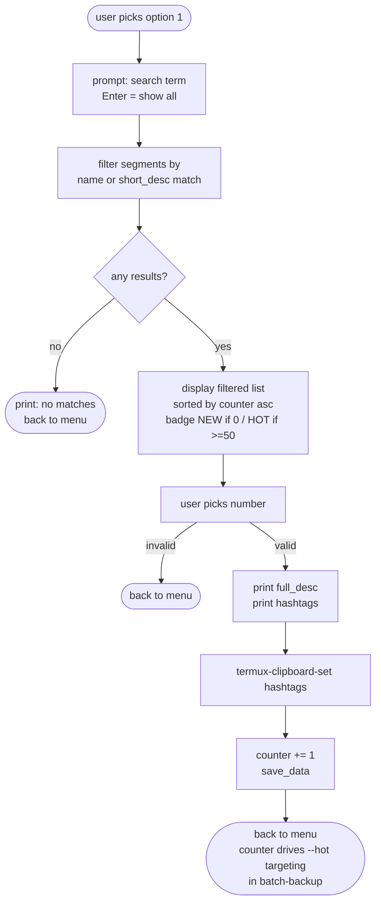
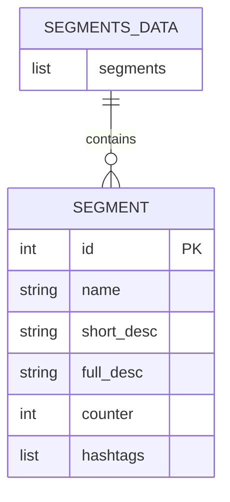

# Termux Dev-Ops: Multi-Device Sync Ecosystem


A robust, distributed post-shoot workflow for high-volume content creators managing
multiple Android devices. Built entirely in **Termux** — no laptop, no cloud
subscription, no desktop tools. The automation is the content.

> **"I scripted my entire post-shoot workflow in Bash — 5 steps, one command, zero laptop.
> What used to take 25 minutes now takes under 4."**
> — Samuel Dixon, Product Test Engineer · Austin TX

---

## Table of Contents

- [Architecture Overview](#architecture-overview)
- [Storage Zones](#storage-zones)
- [Pipeline](#pipeline)
  - [Step 1 · org-camera-album](#step-1--org-camera-album)
  - [Step 2 · batch-backup](#step-2--batch-backup)
  - [Step 3 · backup-all](#step-3--backup-all)
  - [Step 4 · manager](#step-4--manager)
  - [Step 5 · transfer-export](#step-5--transfer-export)
- [Component Deep Dives](#component-deep-dives)
  - [batch-backup](#batch-backup-detail)
  - [manager](#manager-detail)
- [Utility Functions (.bashrc)](#utility-functions-bashrc)
- [Component Complexity Summary](#component-complexity-summary)
- [Design Decisions](#design-decisions)
- [Installation](#installation)
- [Dependencies](#dependencies)
- [Raspberry Pi Setup](#raspberry-pi-setup)

---

## Architecture Overview

This system uses a **Shadow Repository** strategy to keep scripts and environment
configs in sync across three devices via GitHub. Media files live on-device in
Android shared storage, zipped to a canonical `Export/` directory, then transferred
to long-term storage on SD cards or a Raspberry Pi.


```mermaid
flowchart LR
    A([org-camera-album]) -->|moves files| B([batch-backup])
    B -->|zips to Export/| C([backup-all])
    C -->|rsync + git push| D([manager])
    D -->|hashtags to clipboard| E([transfer-export])

    subgraph storage [Android Storage Zones]
        direction TB
        S1[DCIM/Camera\nraw shoot files]
        S2[storage/shared/\nsegment folders]
        S3[storage/shared/Export/\nzip archives]
        S4[GitHub\ntermux-backup repo]
        S5[SD card / Raspberry Pi\nlong-term archive]
    end

    A -.->|reads| S1
    A -.->|writes| S2
    B -.->|reads| S2
    B -.->|writes| S3
    C -.->|reads .shortcuts/| S4
    D -.->|reads/writes| S2
    E -.->|reads| S3
    E -.->|writes| S5
```

---

## Storage Zones

Android's filesystem presents two distinct zones with different permission models.
Understanding this split is critical — it's the source of most path-related bugs.

| Zone | Path | Access | Notes |
|------|------|--------|-------|
| Termux home | `~/` `/data/data/com.termux/files/home/` | Full POSIX | Scripts, config, git repos |
| Shared storage | `~/storage/shared/` → `/sdcard/` | FUSE-mounted | Camera roll, segment folders, Export |
| DCIM | `~/storage/shared/DCIM/Camera/` | FUSE + MediaStore | Raw shoot files, gallery trash |
| Export | `~/storage/shared/Export/` | FUSE | Canonical zip archive location |

> **FUSE gotcha:** Relative paths inside `DCIM/` can silently resolve to wrong
> locations. Always use absolute paths when writing to Export. `zip -r path/to/output.zip .`
> not `zip -r ../Export/output.zip *`.

---

## Pipeline

The full 5-step workflow is orchestrated by `content-pipeline`. Run it after every shoot:

```bash
~/.shortcuts/content-pipeline
```

At step 2 you are prompted for backup mode:
- `y` (default / Enter) — batch-hot: zips all high-volume segments automatically
- `c` — custom: checkbox dialog to hand-pick folders
- `n` — single: one-folder radio picker

---

### Step 1 · org-camera-album

**Purpose:** Move raw shoot files out of `DCIM/Camera` into a named folder in
`storage/shared/`, then refresh the Android gallery via MediaStore.

**Why this step exists:** Android's `DCIM/Camera` is a FUSE-mounted directory under
MediaStore. Files deleted or moved by shell commands don't disappear from the gallery
until MediaStore is explicitly notified. This step fires `termux-media-scan -r` on
both source and destination so the gallery stays consistent.

```
DCIM/Camera/  -->  storage/shared/<your-folder-name>/
                   + termux-media-scan on both paths
```

**Inputs:** User provides destination folder name via `termux-dialog` text prompt.

**Key detail:** Target folder is always created under `storage/shared/` (not inside
DCIM) so `z_backup` can find it without path resolution ambiguity.

---

### Step 2 · batch-backup

**Purpose:** Zip all segment folders from `storage/shared/` into
`storage/shared/Export/`. Replaces the old single-folder `backup-folder` dialog as
the default pipeline step.

**Modes:**

| Flag | Behaviour |
|------|-----------|
| *(none)* | Interactive checkbox — pick any folders |
| `--hot` | Auto-zip all segments with `counter >= 50` |
| `--all` | Zip every segment that has a matching folder |
| `--unzipped` | Zip only segments with no existing zip in Export |

**Segment parity report** runs after every backup and shows:
- Folders with no zip yet (unbacked)
- Segments in `segments_data.json` with no folder on device

See [batch-backup detail](#batch-backup-detail) for full flow diagrams.

---

### Step 3 · backup-all

**Purpose:** Mirror `.shortcuts/` and `.bashrc` to the `termux-backup` GitHub repo
via rsync + git push. Non-interactive and fully automatic.

```bash
# What it does internally:
rsync -av --delete --exclude=".git" ~/.shortcuts/ ~/termux-backup/.shortcuts/
cp ~/.bashrc ~/termux-backup/.bashrc
cd ~/termux-backup && git add -A && git commit -m "Sync from <device>" && git push
```

**Shadow repo strategy:** `rsync --delete` enforces a true 1:1 mirror. If you delete
a script from `.shortcuts/`, the deletion is reflected in the repo on the next push.
When another device runs `sync-in`, it pulls the deletion too. No ghost files.

**Device tagging:** Commit messages include `getprop ro.product.model` so you can see
which device last synced in the git log.

---

### Step 4 · manager

**Purpose:** Search your content series hashtag database, copy hashtags to clipboard,
and auto-increment the usage counter. The counter feeds `--hot` targeting in
`batch-backup` — passively self-tuning backup priority.

**Launched as:** `python ~/.shortcuts/.hidden/segment_manager.py`

**Data file:** `~/.shortcuts/.hidden/segments_data.json`

See [manager detail](#manager-detail) for full REPL and data model diagrams.

---

### Step 5 · transfer-export

**Purpose:** Copy `storage/shared/Export/` zips to long-term storage — either a
physical SD card via USB-C adapter, or a Raspberry Pi over the home network.

**Transport priority:**

```
1. SSH + rsync  (primary — delta transfers, no plaintext credentials)
2. FTP via ncftp (fallback — if SSH unreachable)
```

**Wired path:** Auto-detects USB-C SD card mount under `/storage/XXXX-XXXX/`.
Prompts for SD label (SD1-fitness, SD2-code, etc.) before writing.

**Wireless path:** Prompts for Pi IP if not yet configured. After first run,
set `PI_IP` in the config block at the top of `transfer-export` to avoid
the prompt on subsequent runs.

> **Pre-requisite:** Run `ssh-copy-id pi@<PI_IP>` from Termux once to authorize
> passwordless SSH from your phone to the Pi.

---

## Component Deep Dives

### batch-backup {#batch-backup-detail}

#### Mode selection flow


```mermaid
flowchart TD
    START([batch-backup called]) --> PRE[preflight check\nzip / python3 / jq / termux-dialog]
    PRE -->|missing pkg| FAIL_PRE([exit 1\npkg install hint])
    PRE -->|all present| LOAD[parse segments_data.json\nbuild SEG_NAMES + SEG_COUNTERS arrays]
    LOAD --> MODE{mode arg?}

    MODE -->|--hot| HOT[filter segments\ncounter >= 50]
    MODE -->|--all| ALL[all segments with\na matching folder]
    MODE -->|--unzipped| UNZ[segments with folder\nbut no zip in Export/]
    MODE -->|interactive| DLG[termux-dialog checkbox\nshow all available folders]

    HOT --> RESOLVE
    ALL --> RESOLVE
    UNZ --> RESOLVE
    DLG -->|code -2 = cancel| CANCEL([exit 0])
    DLG -->|selections made| PARSE[parse index field\nfallback: parse text field\nSamsung OneUI compat]
    PARSE --> RESOLVE

    RESOLVE[resolve_folders per segment\nexact + digit-suffix + short-alias match]
    RESOLVE --> DEDUP[deduplicate + filter empty strings]
    DEDUP --> EMPTY{any targets?}
    EMPTY -->|no| PARITY[parity report only]
    PARITY --> EXIT0([exit 0])
    EMPTY -->|yes| LOOP

    subgraph LOOP [zip loop]
        direction TB
        L1[for each folder] --> L2[z_backup folder]
        L2 -->|success| L3[PASS++\nprint size]
        L2 -->|fail| L4[FAIL++\nadd to FAILED list]
        L3 --> L5{more folders?}
        L4 --> L5
        L5 -->|yes| L1
        L5 -->|no| SUMMARY
    end

    SUMMARY[print summary\nSucceeded / Failed counts] --> PARITY2[parity report\nshows unbacked segments]
    PARITY2 --> RESULT{FAIL == 0?}
    RESULT -->|yes| OK([exit 0])
    RESULT -->|no| ERR([exit 1\npipeline halts])
```

#### resolve_folders matching strategy

Segment names don't always match folder names 1:1. The `resolve_folders` function
uses a four-tier matching strategy to handle real-world naming conventions:


```mermaid
flowchart TD
    IN([segment name e.g. mcp]) --> E1{shared/mcp\nexists?}
    E1 -->|yes| ADD1[add: mcp]
    E1 -->|no| E2

    E2[scan all dirs in shared/] --> E3{name + digits?\ne.g. mcp96 mcp98}
    E3 -->|match| ADD2[add: mcp96 mcp98]
    E3 -->|no match| E4

    E4{single letter + digits?\ne.g. m81 m90-m99} --> E5{first char matches\nAND segment len <= 4?}
    E5 -->|yes| ADD3[add: m81 m90...m99]
    E5 -->|no| E6

    E6{DCIM/mcp\nexists?} -->|yes| ADD4[add: mcp via DCIM path]
    E6 -->|no| DONE2

    ADD1 --> DONE[sort -u\nreturn unique list]
    ADD2 --> DONE
    ADD3 --> DONE
    ADD4 --> DONE
    DONE2([no matches\nreturn empty])
```

**Real-world example** — segment `mcp` matches all of:
`mcp/` `mcp96/` `mcp98/` `m81/` `m90/` `m91/` ... `m99/`

#### z_backup internals


```mermaid
flowchart TD
    IN2([z_backup folder-name]) --> BIN[locate zip binary\nfull Termux path first\nfallback: command -v zip]
    BIN -->|not found| FAIL2([exit 1\npkg install zip])
    BIN -->|found| RES[resolve src path\nshared/ first\nthen DCIM/]
    RES -->|not found| FAIL3([exit 1])
    RES -->|found| EMPTY2{ls -A src\nempty?}
    EMPTY2 -->|yes| SKIP([return 0\nSKIPPED warning])
    EMPTY2 -->|no| MKDIR[mkdir -p Export/]
    MKDIR --> ZIP[cd into src\nzip -9 -r zip_path .]
    ZIP -->|exit 0| SIZE[du -sh zip\nprint size + path]
    ZIP -->|exit != 0| CLEAN[rm partial zip\nreturn 1]
    SIZE --> OK2([return 0])
```

> **Why `zip -r .` not `zip *`:**  
> The `*` glob fails when a folder is empty, skips subdirectories, and chokes on
> filenames with spaces. `zip -9 -r "$zip_path" .` recurses everything from the
> current directory unconditionally and always exits 0 on a non-missing path.

> **Why hardcode the zip binary path:**  
> Scripts sourced from `batch-backup` inherit a reduced `$PATH`. Hardcoding
> `/data/data/com.termux/files/usr/bin/zip` ensures the binary is found regardless
> of invocation context — interactive terminal, Termux Widget shortcut, or Termux:Boot.

---

### manager {#manager-detail}

#### Top-level REPL loop


```mermaid
flowchart TD
    START2([python3 segment_manager.py]) --> LOAD2[load segments_data.json\ndefault data if missing/corrupt]
    LOAD2 --> PCHECK[parity check on startup\nwarn on unbacked segments]
    PCHECK --> MENU

    subgraph MENU [main menu loop]
        direction TB
        M0[print menu\nsorted by usage least to most] --> INPUT{user input}
        INPUT -->|1| SEARCH[Search and Copy]
        INPUT -->|2| ADD[Add new series]
        INPUT -->|3| EDIT[Edit series]
        INPUT -->|4| DELETE[Delete series]
        INPUT -->|5| LIST[List all + stats]
        INPUT -->|q| QUIT([exit 0])
        SEARCH --> SAVE[save_data\ncounter += 1]
        ADD --> SAVE
        EDIT --> SAVE
        DELETE --> SAVE
        SAVE --> M0
        LIST --> M0
    end
```

#### Search and Copy flow (option 1 — most used path)


```mermaid
flowchart TD
    S1([user picks option 1]) --> S2[prompt: search term\nEnter = show all]
    S2 --> S3[filter segments by\nname or short_desc match]
    S3 --> S4{any results?}
    S4 -->|no| S5([print: no matches\nback to menu])
    S4 -->|yes| S6[display filtered list\nsorted by counter asc\nbadge NEW if 0 / HOT if >=50]
    S6 --> S7[user picks number]
    S7 -->|invalid| S8([back to menu])
    S7 -->|valid| S9[print full_desc\nprint hashtags]
    S9 --> S10[termux-clipboard-set hashtags]
    S10 --> S11[counter += 1\nsave_data]
    S11 --> S12([back to menu\ncounter drives --hot targeting\nin batch-backup])
```

#### Data model


```mermaid
erDiagram
    SEGMENTS_DATA {
        list segments
    }
    SEGMENT {
        int id PK
        string name
        string short_desc
        string full_desc
        int counter
        list hashtags
    }
    SEGMENTS_DATA ||--o{ SEGMENT : contains
```

**Active segments by usage** (as of last sync):

| Counter | Segment | Description |
|---------|---------|-------------|
| 371 | `pistol` | pistol squats |
| 125 | `boulder` | rock climbing |
| 100 | `mcp` | push/pull/legs gym split |
| 68 | `skip` | jump rope |
| 48 | `ball` | basketball |
| 27 | `box` | boxing |
| 26 | `stands` | handstands |
| 24 | `mcped` | educational gym content |
| 13 | `skate` | longboarding |
| ... | *(18 more)* | |

> Segments with `counter >= 50` are automatically targeted by `batch-backup --hot`.
> The counter increments passively on every hashtag copy — no manual configuration needed.

---

## Utility Functions (.bashrc)

Functions sourced into every shell session and available to all scripts.

### z_backup

Zip a named folder from `storage/shared/` to `storage/shared/Export/`.
Resolves paths in `shared/` first, falls back to `DCIM/` subfolders.

```bash
z_backup pistol          # zips ~/storage/shared/pistol/
z_backup Camera          # zips ~/storage/shared/DCIM/Camera/
zb pistol                # alias
```

### z_restore

Unzip the newest backup of a named folder back to its original location.

```bash
z_restore pistol         # restores from newest pistol_*.zip
zr pistol                # alias
```

### clean_termux

Clean five junk zones that accumulate silently:
`~/.local/share/Trash/` · `$PREFIX/var/cache/apt/archives/` ·
`$PREFIX/tmp/` · `~/.cache/pip/` · `~/storage/shared/.Trash-*/`

```bash
clean-termux             # scan → confirm → wipe
clean-termux --dry       # show sizes only
clean-termux --force     # skip confirmation
```

### empty_gallery_trash

Remove Android gallery trash (files hidden by MediaStore `IS_TRASHED=1` flag).
Bypasses the 30-day cooldown and fires `termux-media-scan` to clear phantom
gallery thumbnails.

```bash
empty-gallery-trash              # scan → warn → confirm → delete
empty-gallery-trash --dry        # preview only
empty-gallery-trash --force      # no prompt (use after batch backup)
```

---

## Component Complexity Summary

| Script | Lines | Mode | Complexity driver |
|--------|-------|------|-------------------|
| `batch-backup` | ~390 | bash | 4 run modes, folder resolution strategies, Samsung OneUI dialog compat, pipeline exit codes |
| `segment_manager.py` | ~200 | python REPL | stateful counter, CRUD, clipboard integration, parity check |
| `transfer-export` | ~200 | bash | dual transport SSH/rsync + FTP fallback, USB mount auto-detect, SD label routing |
| `content-pipeline` | ~180 | bash | 5-step orchestration, exit code propagation, y/c/n branching at step 2 |
| `org-camera-album` | ~50 | bash | FUSE path resolution, termux-media-scan dual-dir refresh |
| `backup-all` | ~30 | bash | rsync --delete mirror + git diff detection + device tagging |
| `z_backup` (.bashrc) | ~45 | bash func | binary path resolution, recursive zip, empty folder guard, size reporting |
| `clean_termux` (.bashrc) | ~80 | bash func | 5-zone audit, colour-coded size report, apt autoremove |
| `empty_gallery_trash` (.bashrc) | ~70 | bash func | MediaStore dotfile detection, media-scan notification |

---

## Design Decisions

**Decomposable scripts over a monolith**

Each script exits with a meaningful code and runs standalone or inside
`content-pipeline`. You can test `z_backup pistol` without running the full
pipeline. Failures halt at the exact failing step with a clear message. This
also means each component can be recorded as a standalone YouTube episode.

**segments_data.json drives backup priority**

The `counter` field is a passive usage signal — every hashtag copy in `manager`
increments it. `--hot` targeting in `batch-backup` is therefore self-tuning:
high-volume series surface automatically. No manual priority lists to maintain.

**Why SSH over FTP for Pi transfer**

rsync over SSH gives delta transfers (only changed bytes), connection reuse,
and no plaintext credentials on the wire. FTP is kept as a fallback only
because `vsftpd` is simpler to set up headlessly before SSH keys are exchanged.

**Why full Termux binary paths in z_backup**

Scripts sourced from `batch-backup` inherit a reduced `$PATH`. Hardcoding
`/data/data/com.termux/files/usr/bin/zip` ensures the binary resolves regardless
of invocation context — interactive terminal, Termux Widget shortcut, or Termux:Boot.
The function probes the hardcoded path first, falls back to `command -v zip`, and
prints `pkg install zip` if neither works.

**Why the Shadow Repo strategy**

Standard git repos don't handle Termux's live `.shortcuts/` directory well —
you'd have to work directly inside the repo. The shadow approach lets scripts
live at their natural paths (`~/.shortcuts/`) while `backup-all` mirrors them
into `~/termux-backup/` for git tracking. `rsync --delete` ensures deletions
propagate. Any device that runs `sync-in` gets an exact replica.

---

## Installation

```bash
# 1. Install dependencies
pkg update && pkg install git rsync python jq zip termux-api

# 2. Grant storage access
termux-setup-storage

# 3. Clone the repo
git clone https://github.com/SamuelDixxon/termux-backup ~/termux-backup

# 4. Install scripts and config
cp ~/termux-backup/.shortcuts/* ~/.shortcuts/
cp ~/termux-backup/.bashrc ~/.bashrc

# 5. Load functions and aliases
source ~/.bashrc

# 6. Make scripts executable (required for Termux Widget green icon)
chmod +x ~/.shortcuts/*

# 7. Verify z_backup works
zb pistol
```

---

## Dependencies

| Package | Install | Used by |
|---------|---------|---------|
| `zip` | `pkg install zip` | z_backup, batch-backup |
| `python` | `pkg install python` | manager (segment_manager.py) |
| `jq` | `pkg install jq` | batch-backup, backup-folder |
| `rsync` | `pkg install rsync` | backup-all, transfer-export |
| `git` | `pkg install git` | backup-all, sync-in |
| `termux-api` | `pkg install termux-api` | org-camera-album, backup-folder, manager |
| `openssh` | `pkg install openssh` | transfer-export (SSH to Pi) |
| `ncftp` | `pkg install ncftp` | transfer-export (FTP fallback) |

> **Note:** `zip` is not installed by default in Termux. If `z_backup` exits with
> code 127, run `pkg install zip`.

---

## Raspberry Pi Setup

The wireless path in `transfer-export` targets a headless Raspberry Pi on your
home network.

**One-time Pi configuration:**

```bash
# On the Pi — enable SSH and install rsync
sudo apt update && sudo apt install rsync openssh-server -y
sudo systemctl enable ssh && sudo systemctl start ssh

# Set a static IP (edit /etc/dhcpcd.conf):
# interface wlan0
# static ip_address=192.168.1.100/24
# static routers=192.168.1.1

# Optional: FTP fallback
sudo apt install vsftpd -y
sudo systemctl enable vsftpd && sudo systemctl start vsftpd
```

**From Termux on the phone — authorize SSH key:**

```bash
pkg install openssh
ssh-keygen -t ed25519          # generate key if needed
ssh-copy-id pi@192.168.1.100   # passwordless from here on
```

**Update `transfer-export` config block:**

```bash
PI_USER="pi"
PI_IP="192.168.1.100"          # your Pi's static IP
PI_DEST="/home/pi/sd-archive"
```

---

## Author

**Samuel Dixon** · Product Test Engineer · Austin, TX  
[linktr.ee/sdixoninvesting](https://linktr.ee/sdixoninvesting) · [sdixoninvesting@gmail.com](mailto:sdixoninvesting@gmail.com)

*Outdoors · Tech · Fitness · Education*
