# Termux Dev-Ops: Multi-Device Sync Ecosystem

A robust, distributed workflow for high-volume content creators managing multiple mobile devices (**Samsung S23+**, **Google Pixel 9a**, **ZFlip7**).

## 🏗 System Architecture

This system utilizes a **Shadow Repository** strategy to manage Termux scripts and environment configurations across hardware.

### The "Mirror" Logic (System Level)
Unlike standard backups, this system uses `rsync --delete` to enforce a bidirectional "Source of Truth":
1.  **Local Deletions:** If a script is deleted in `~/.shortcuts`, running `backup-all` physically removes it from the Git staging area (`~/termux-backup`) and pushes the deletion to GitHub.
2.  **Global Deletions:** When other devices run `sync-in`, the `git reset --hard` and `rsync --delete` flags ensure ghost files are purged from the local handset.

## 🛠 Component Breakdown

### Core Scripts (~/.shortcuts/)
* **backup-all**: Enforces a 1:1 mirror from the device system to the Cloud. Captures additions, edits, and deletions.
* **sync-in**: Forces the device to match the Cloud exactly. Wipes local "junk" scripts and updates environment variables.
* **manager**: A Python-based CRUD interface for the Content Segment database.
* **org-camera-album**: Automates the movement and gallery-refreshing of raw media files.
* **iir-log**: A background service logging detailed battery telemetry to CSV.

### Data Engine (.hidden/)
* **segments_data.json**: The central database for tracking video series counters and optimized hashtag groups.
* **segment_manager2.py**: The logic engine for maintaining metadata consistency across all three phones.

## 📊 System Architecture Diagram

```mermaid
flowchart TB
    subgraph "Device Fleet"
        S23["📱 Samsung S23+"]
        Pixel["📱 Google Pixel 9a"]
        ZFlip["📱 ZFlip7"]
    end

    subgraph "GitHub Cloud"
        Repo["🌐 termux-backup repo<br/>(Source of Truth)"]
    end

    subgraph "Core Scripts ~/.shortcuts/"
        BA["backup-all<br/>🔄 Push device → Cloud"]
        SI["sync-in<br/>⬇️ Pull Cloud → device"]
        MGR["manager<br/>📊 Hashtag/content CRUD"]
        CAM["org-camera-album<br/>📁 Media organizer"]
        IIR["iir-log<br/>🔋 Battery logger"]
        BU["backup-folder<br/>💾 Folder backup"]
    end

    subgraph "Hidden Engine .hidden/"
        SEG["segment_manager.py<br/>🎬 Content tracker"]
        DATA["segments_data.json<br/>#️⃣ Hashtag database"]
    end

    S23 <-->|"backup-all / sync-in"| Repo
    Pixel <-->|"backup-all / sync-in"| Repo
    ZFlip <-->|"backup-all / sync-in"| Repo

    BA -->|"rsync --delete"| Repo
    Repo -->|"git reset --hard"| SI
    SI -->|"rsync --delete"| S23
    SI -->|"rsync --delete"| Pixel
    SI -->|"rsync --delete"| ZFlip

    MGR --> SEG
    SEG --> DATA
    CAM -->|"mv + refresh"| S23
    IIR -->|"every 20min"| battery_log["battery_status_log.txt"]
```



### Script Reference Table

| Script | Purpose | Direction |
|--------|---------|-----------|
| `backup-all` | Mirrors local → GitHub, deletes cloud files you deleted locally | ↑ Push |
| `sync-in` | Force-resets local to match GitHub exactly (destructive pull) | ↓ Pull |
| `manager` | Python CRUD for content segments & hashtag groups | 📊 Data |
| `org-camera-album` | Moves camera photos to named folders + refreshes gallery | 📁 Media |
| `iir-log` | Background battery logger (temp, voltage, health) every 20min | 🔋 Monitor |
| `backup-folder` | One-off folder backups | 💾 Archive |

## 🚀 Deployment

### Prerequisites
```bash
pkg install rsync git termux-api python jq
