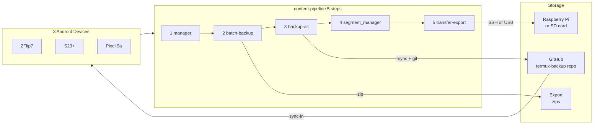
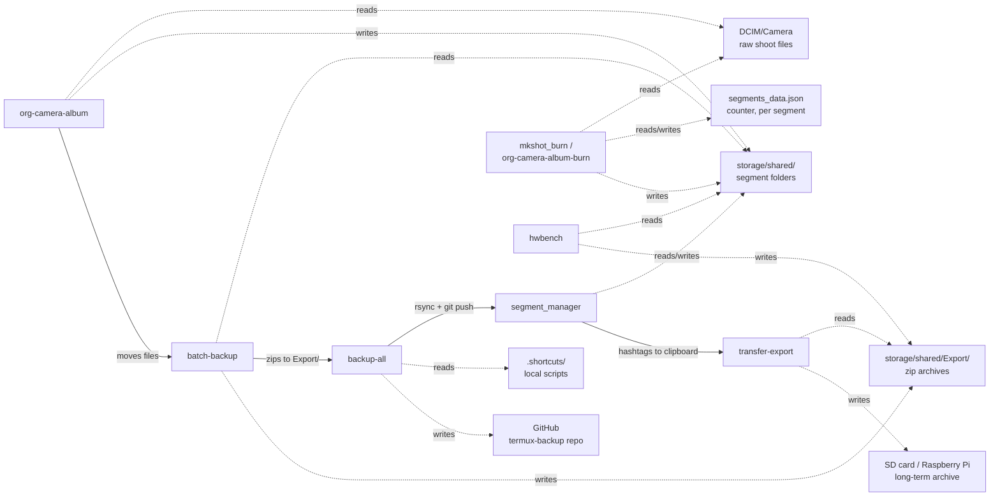

# Architecture

## System diagram

## Data Flow

Which component reads and writes which storage location -- the dependency
graph underneath the step sequence above.

`segments_data.json` is the one piece of shared state almost everything
touches -- `segment_manager`, the burn tooling, and `seg_add`/`seg_set_counter`/
`seg_bump` in `.bashrc` all read and write the same file, matched by `name`
in its `segments` list (not a dict keyed by segment, which an earlier draft
of the burn tooling guessed wrong on).
