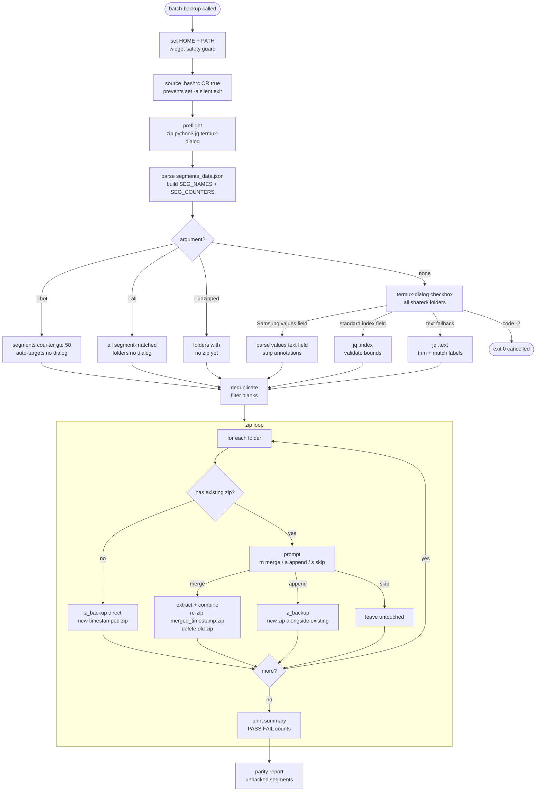
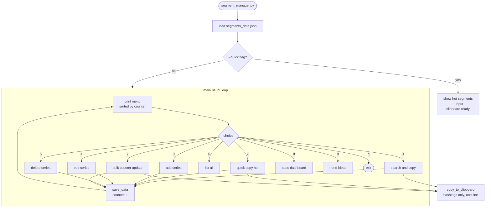
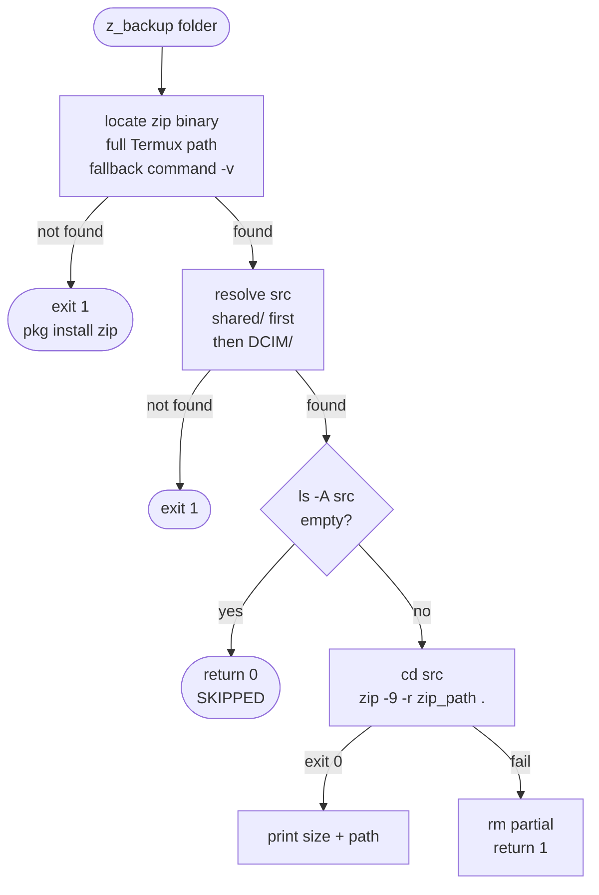
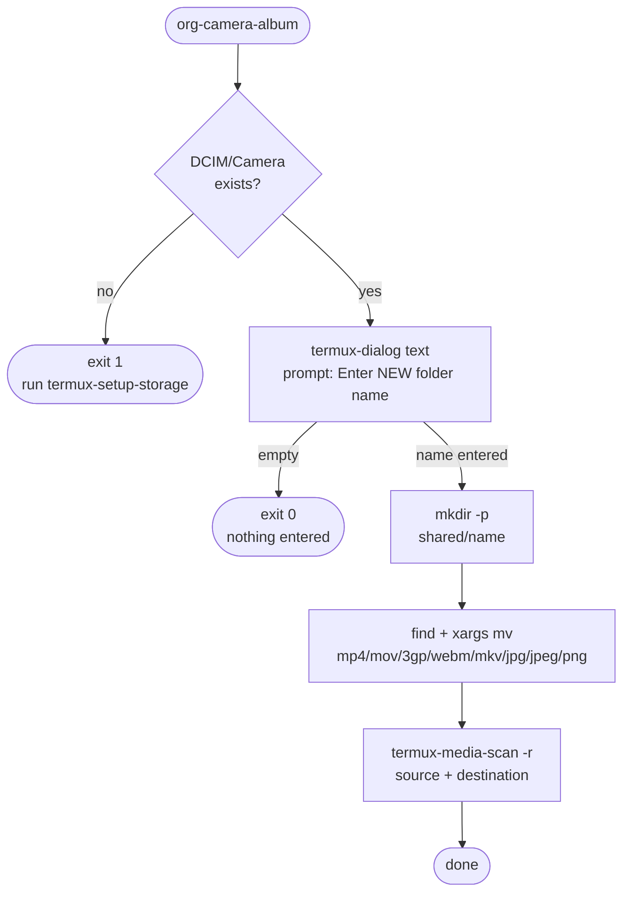
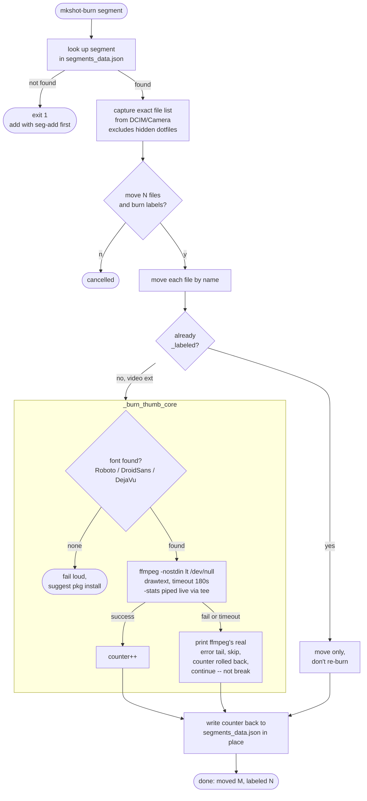
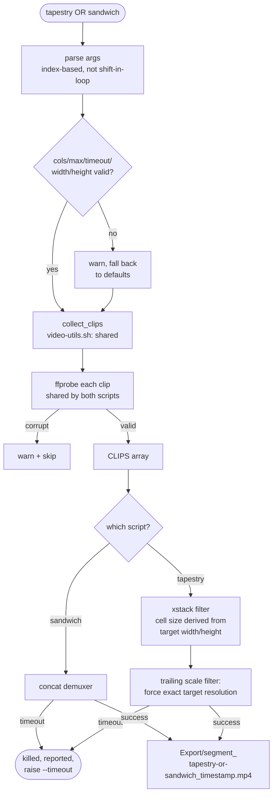

# Component Deep Dives

## batch-backup

Four run modes. The core workhorse of the pipeline.



**Known issue:** checkbox dialog (`none` mode) confirmed showing on ZFlip7 but
selection not zipping. Root cause: Samsung returns
`values: [{index:N, text:"name"}]` not a flat array. Fix in v3: `parse values text field`.
Status: deployed, awaiting test confirmation. *(Not reviewed this session --
`batch-backup`'s source hasn't been shared, so this status is carried over
unverified.)*

**Merge/append/skip** -- tested and working on ZFlip7. When a folder already
has a zip in Export/, you are prompted:
- `m` merge: extract + combine files + re-zip as single archive
- `a` append: new timestamped zip alongside existing (default)
- `s` skip: leave existing untouched

---

## segment_manager

Python REPL. The counter drives `--hot` targeting in batch-backup passively.

**Corrected this pass:** the clipboard used to output a `<segment><counter>`
title line plus platform-tailored hashtag sets. Both were removed: the
clipboard now copies **hashtags only**, straight from the segment's own
`hashtags` list in `segments_data.json`, with no platform branching and no
title line -- system state lives entirely in that one JSON schema, not
duplicated per output target.



**Real `segments_data.json` schema** (list, not a dict keyed by name):

```json
{
  "segments": [
    {
      "id": 19,
      "name": "pistol",
      "short_desc": "pistol squats",
      "full_desc": "pistol squats",
      "counter": 555,
      "hashtags": ["#squats", "#pistolsquats", "#legs", "#calisthenics", "#core"]
    }
  ]
}
```

Every script in the pipeline that touches segment data (`burn_thumb.sh`,
`mkshot_burn`, `org-camera-album-burn.sh`, `seg_add`/`seg_set_counter`/
`seg_bump` in `.bashrc`) matches against this list-by-`name` shape, not a
dict keyed by segment name -- an earlier draft of the burn tooling guessed
wrong on this and had to be corrected once the real file was shared.

---

## z_backup internals



**Why `zip -r .` not `zip *`:**
The `*` glob fails on empty dirs, skips subdirectories, and errors on
filenames with spaces. `zip -9 -r "$zip_path" .` recurses everything
unconditionally. Exit code 127 = zip binary not in PATH -- fix: `pkg install zip`.

---

## org-camera-album

**Corrected this pass.** The previous version of this doc described a
smart radio-dialog router (hot segments sorted to the top, one-tap
routing, marked "tested" in the changelog). Once the actual script was
shared, that turned out not to match reality -- the real `org-camera-album`
is simpler and **not segment-aware at all**:



It's a free-text prompt for **any** folder name -- new or existing, no
awareness of `segments_data.json`, no counter, no hot-segment sorting. The
segment-aware, counter-tracking variants are `mkshot`/`mkshot_burn` in
`.bashrc` and the standalone `org-camera-album-burn.sh` (see next section) --
those are newer additions layered alongside the original script, not a
replacement for it.

**v4 proposed -- org-collect:** Extends this to pull from 6 sources
(DCIM, Instagram Edits, Quick Share, Downloads, Screenshots, CapCut)
in a single pass, reading destination from `session.json`. Unchanged from
the original proposal; still not built.

---

## burn_thumb.sh / mkshot_burn / org-camera-album-burn

New this session. Burns a sequential text label ("Pistol 554") onto the
first few seconds of each clip in a segment, using `ffmpeg`'s `drawtext`
filter, and keeps `segments_data.json`'s counter in sync automatically.

**Three entry points, one shared core:**

| Entry point | Where | What it does |
|---|---|---|
| `burn_thumb` (`burnthumb`) | `burn_thumb.sh` | Single file, reads label from `session.json` or prompts |
| `burn_thumb_segment` (`burnthumbsegment`) | `burn_thumb.sh` | Batch-burns an already-populated folder |
| `mkshot_burn` (`mksb`) | `.bashrc` | Moves DCIM/Camera into a segment folder **and** burns in one step |
| `org-camera-album-burn.sh` | standalone script | Same as `mkshot_burn`, styled like the original `org-camera-album` (jq-parsed dialog, `set -x`) |

All four call the same `_burn_thumb_core` function, sourced once from
`burn_thumb.sh` -- `.bashrc` no longer keeps its own copy. That
consolidation happened *because* duplicating it caused real bugs: fixes
applied to one copy didn't propagate to the other, and it took a couple of
rounds to notice.



**Style:** centered on frame, fontsize 120, 6px black border (not the
original bottom-third drop-shadow style).

---

## tapestry / sandwich / video-utils.sh

Originally one dual-mode script (`--concat`/`--grid`); split into two
single-purpose tools after concat (the default mode) produced the wrong
output when the goal was a grid -- one flag you had to remember to pass
was one too many failure modes.

- **`tapestry`** -- NxN grid, all clips playing simultaneously (e.g. "100
  pistol squats in 30 seconds" style posts). Output resolution is
  configurable (`--width`/`--height`, or `--vertical`/`--square`/
  `--landscape` shortcuts) and *forced* to exactly match the target via a
  trailing `scale` filter -- cell size used to be hardcoded at 480x270
  regardless of `--cols`, so the grid never actually filled a phone screen
  when played back.
- **`sandwich`** -- sequential concatenation into one long reel. This is
  the tool for turning a folder of short clips into continuous long-format
  content.
- **`video-utils.sh`** -- shared library both source: clip collection
  (case-insensitive extensions, dotfile exclusion), upfront `ffprobe`
  validation (one corrupt clip no longer takes down a whole grid/concat
  job), numeric-flag sanitizing, and the `-nostdin`/timeout ffmpeg-safety
  pattern established in `burn_thumb.sh`.



Corrected/hardened this pass: case-sensitive extension matching (`.MP4` was
invisible), no clip validation in grid mode, no timeout protection,
`--cols 0` divide-by-zero, malformed numeric flags crashing instead of
falling back, `--help` as the first argument being swallowed as a segment
name, and the grid-doesn't-fill-the-screen sizing bug. All verified against
a stubbed ffmpeg/ffprobe harness, including a deliberately-hung ffmpeg
confirming the timeout kills it in the configured time rather than the
full hang duration.

---

## hwbench

The benchmark harness has its own doc: [hwbench](hwbench.md) --
test-matrix design, the MediaCodec reliability question, and the
[hwbench2](../) 3-SoC experiment extension.
