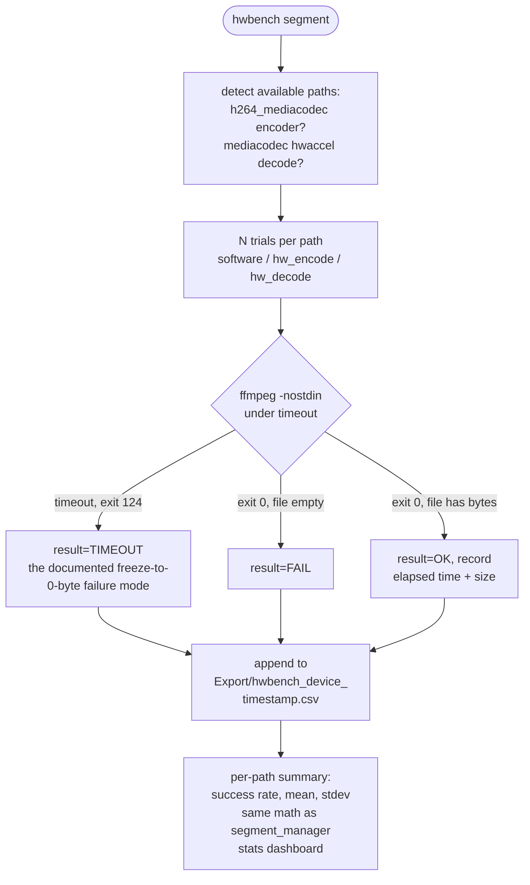

# hwbench — cross-device benchmark harness

A test matrix, not a demo: repeated trials of software encode (`libx264`),
hardware encode (`*_mediacodec`), and hardware-decode-plus-software-encode,
run identically on any device. Built to answer a specific question with
data instead of forum anecdotes -- is ffmpeg's MediaCodec hardware
acceleration actually reliable on the ZFlip7 (Exynos) and the Pixel 9a
(Tensor), and is it faster when it works?

**Why this matters beyond the pipeline:** Termux's ffmpeg does ship
MediaCodec hardware acceleration, but real-world reliability is documented
as inconsistent across devices -- working on some, freezing and producing
a 0-byte output on others, decoder dimension bugs reported on certain
Android/chipset combinations. `hwbench` measures what's actually true on
these two specific devices rather than trusting vendor claims. The
`-s "$out"` check (non-empty, not just exists) exists specifically because
the documented failure mode is an `exit 0` with a 0-byte file -- verified
against a stub simulating that exact behavior, plus a genuine hang (2s
timeout, 2s wall-clock, not the full simulated 300s hang).

## hwbench2 — the 3-SoC experiment

`hwbench2` extends the harness into a designed experiment: 3 SoCs (Exynos 2500,
Snapdragon 8 Gen 2, Tensor G4) × h264/hevc × software/hardware paths, with
thermal and power telemetry (skin temp, CPU freq, battery per run), sustained
heat-soak blocks, and a proper DOE.

- DOE + week plan: `hwbench2-doe-and-week-plan.md` (goal workspace)
- Scripts: `hwbench2.sh`, `hwbench_plot.py`
- Reusable DOE skeleton: `doe-template.md`

Results will land here as a "hwbench2 results" section once the runs complete.
