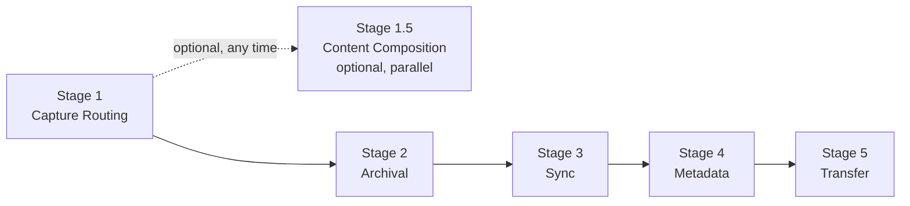
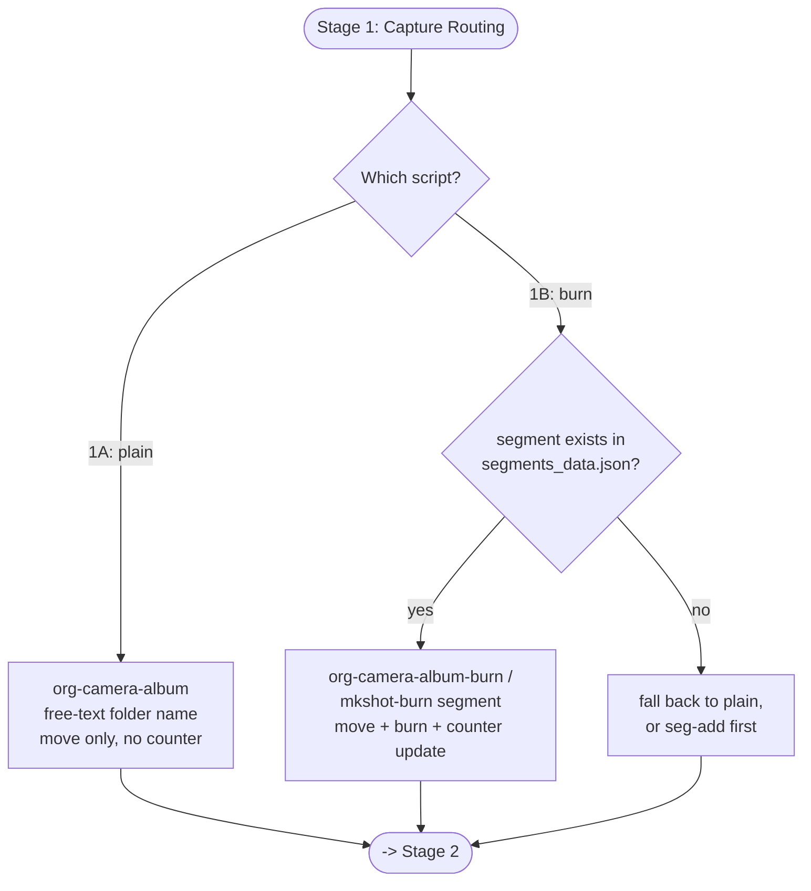
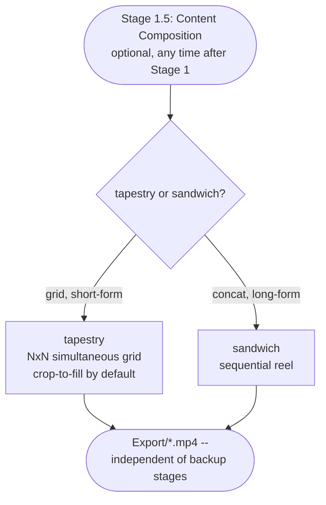
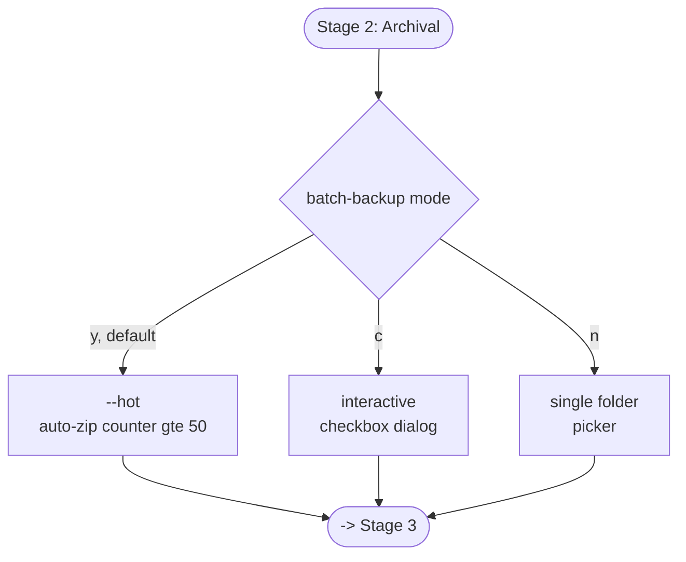
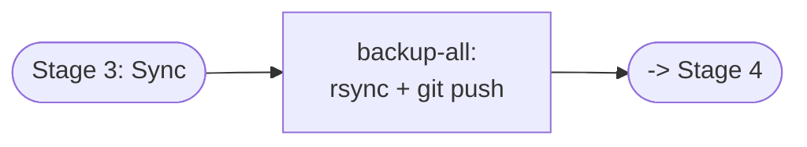
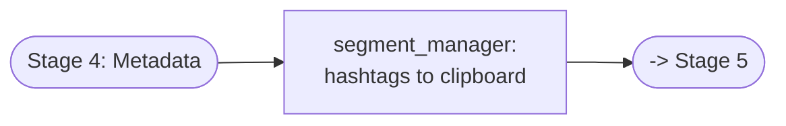
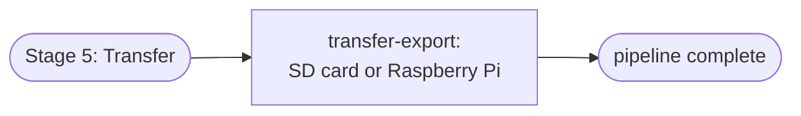
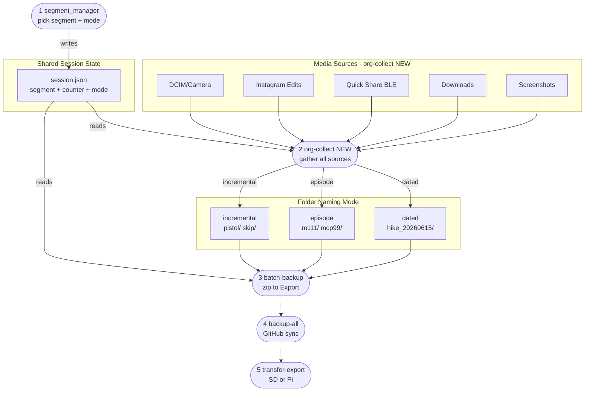

# Pipeline Stages

Each stage below is independently runnable -- see
[Stage Aliases](testing.md) for isolated invocation
and a non-destructive regression sweep. The choice of *which* script runs
a stage lives at the stage level, not buried in a single monolithic
flowchart -- each stage gets its own small diagram instead of one
giant combined one.



Full end-to-end run: `bash ~/.shortcuts/content-pipeline`.

---

## Stage 1 -- Capture Routing

Two options, chosen per-run: plain (works for any folder, no counter) or
burn (requires the segment to already exist, since it needs a live
counter to label against). This was the "Pipeline v5" proposal in earlier
versions of this doc -- folded in directly now since the design settled
and the underlying scripts (`mkshot_burn`, `org-camera-album-burn.sh`)
have been through several real rounds of bug fixes.



**Open question for actual `content-pipeline` integration:** does Stage 1
currently know the segment name ahead of time, or is it picked
interactively mid-step (as `org-camera-album`'s free-text dialog does
today)? That determines whether the 1A/1B choice happens before or after
name entry. Share that script and this becomes a real diff instead of a
design doc.

---

## Stage 1.5 -- Content Composition (optional, parallel)

Not part of the backup chain -- a different purpose entirely (content
production, not archival), so it doesn't gate Stages 2-5. Runs any time
after Stage 1 has populated a folder.



---

## Stage 2 -- Archival



---

## Stage 3 -- Sync



---

## Stage 4 -- Metadata



Full internal detail (menu options, clipboard format) is in the
[segment_manager](components.md#segment_manager) deep dive -- this is just the
stage-level view.

---

## Stage 5 -- Transfer



---

## Future Proposal -- Session-First Reordering (v4)

Independent of the Stage 1 burn/plain choice above -- a different idea:
`segment_manager` moves to **step 1** so the selected segment name
flows via `session.json` into every downstream step. No duplicate prompts.



### session.json schema

```json
{
  "segment": "pistol",
  "counter": 181,
  "mode": "incremental",
  "timestamp": "2026-06-15T14:30:00"
}
```

| mode | folder | use case |
|------|--------|----------|
| `incremental` | `pistol/` | open-ended series, files accumulate |
| `episode` | `m111/` | numbered series, each shoot discrete |
| `dated` | `hike_20260615/` | one-off or travel content |
