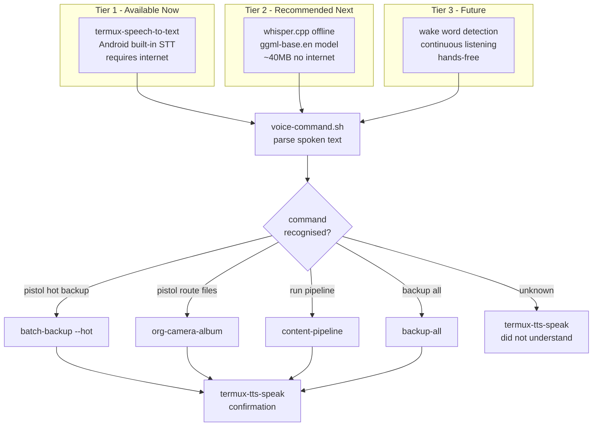

# Proposals

Ideas not yet built. Proposals graduate to their component doc once implemented.

## Voice Control (proposed)

Reduce friction for high-volume daily content. Instead of widget taps
and text input, speak the segment name and command.



### Tier 1 -- termux-speech-to-text (start here)

Already available if `termux-api` is installed:

```bash
pkg install termux-api

# Test it:
termux-speech-to-text
# speak "pistol hot backup"
# outputs: pistol hot backup
```

### Tier 2 -- whisper.cpp offline (recommended)

Build whisper.cpp on device, download the base.en model (~40MB),
record audio with `ffmpeg`, and transcribe locally without internet.
The ZFlip7's Exynos 2500 handles the base model in under 3 seconds.

```bash
pkg install git cmake clang make ffmpeg
git clone --depth 1 https://github.com/ggerganov/whisper.cpp.git
cd whisper.cpp
cmake -B build && cmake --build build -j4
bash models/download-ggml-model.sh base.en
```

### voice-command.sh (to build)

```bash
#!/data/data/com.termux/files/usr/bin/bash
# Record 3 seconds, transcribe, route to pipeline component
ffmpeg -f android_mic -t 3 /tmp/voice.wav -y 2>/dev/null
WORDS=$(~/whisper.cpp/build/bin/whisper-cli         -m ~/whisper.cpp/models/ggml-base.en.bin         -f /tmp/voice.wav --no-timestamps -otxt 2>/dev/null)

case "${WORDS,,}" in
    *pipeline*)      bash ~/.shortcuts/content-pipeline ;;
    *hot*backup*)    bash ~/.shortcuts/batch-backup --hot ;;
    *route*|*album*) bash ~/.shortcuts/org-camera-album ;;
    *sync*|*github*) bash ~/.shortcuts/backup-all ;;
    *)  termux-tts-speak "Did not understand: $WORDS" ;;
esac
```

### Other efficiency ideas

| Idea | Mechanism | Effort |
|------|-----------|--------|
| Voice-triggered pipeline | `termux-speech-to-text` + keyword routing | Low |
| Offline transcription | `whisper.cpp` base.en model | Medium |
| Auto-route on file detect | `inotifywait` watches DCIM, triggers org-camera-album | Medium |
| Garmin/Strava auto-tag | Parse .fit file date, match to segment folder by timestamp | Medium |
| Batch post scheduler | Write post queue to JSON, cron job copies hashtags at scheduled times | Medium |
| Wear OS / Galaxy Watch | Tap watch face to trigger widget shortcuts via Bluetooth | High |
